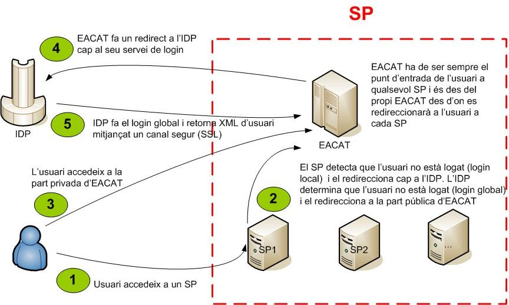

# IDP SIID - Manual desenvolupador SP

## INDEX

- [1. Introducció](#1)
- [2. Esquema de la solució](#2)
- [3. Accions preliminars](#3)
   * [3.1 URLs d&#39;accés](#3.1)
        * [3.1.1 URLs de Desenvolupament ](#3.1.1)
		* [3.1.2 URLs de Preproducció](#3.1.2)
		* [3.1.3 URLs de Producció](#3.1.3)
-  [4. Components a desenvolupar](#4)
	* [4.1 Login](#4.1)
	* [4.2 Post-login](#4.2)
	* [4.3 Logout](#4.3)
	* [4.4 Post-Logout](#4.4)
-  [5. Accions posteriors](#5)
	* [5.1 Caducitat de les sessions dels SPs](#5.1)
	* [5.2 Caducitat de les sessions de l&#39;IDP](#5.2)
-  [6. Errors freqüents en la integració](#6)
	* [6.1 El sistema demana autenticar-se dos vegades](#6.1)	

# 1 Introducció <a name="1"></a>

L&#39;objectiu del present document és subministrar la informació necessària als desenvolupadors d&#39;aplicacions Web que vulguin incloure la seva aplicació dins el _Single Sign On_ (SSO) d&#39;AOC.

# 2 Esquema de la solució <a name="2"></a>

A continuació es mostra un esquema amb els components que intervenen a la solució, així com el paper de cadascun d&#39;ells.



- **SP** ¹ : aplicacions webs que ofereixin serveis als usuaris i que necessiten autenticar aquests.
- **IDP** ² : aplicació web encarregada d&#39;orquestrar el SSO. Rep peticions de _login_ i _logout_ i demana les credencials a l&#39;usuari (_login_ / _pwd_ o certificat).
- **EACAT:** és un SP especial, doncs és el punt d&#39;entrada de l&#39;usuari per a qualsevol SP i des de l&#39;EACAT es redireccionarà l&#39;usuari a qualsevol dels SP a on pugui accedir.

Les accions 4 i 5 de l&#39;esquema són també aplicables per a qualsevol SP. A l&#39;annex A es descriu tot el procés de forma més detallada.

¹  Service Provider
² Identity Provider


# 3 Accions preliminars <a name="3"></a>

Abans de començar el desenvolupament, es necessari que el SP tingui accés a un IDP, encarregat de validar les credencials dels usuaris que vulguin accedir a l&#39;aplicació. Això implica, entre altres coses, obtenir la següent informació de l&#39;IDP:

- Punt d&#39;entrada <br>Un usuari que encara no hagi iniciat una sessió a cap SP haurà d&#39;iniciar la sessió sempre des del mateix punt: EACAT

- Adreça del servei de _login_<br>Aquest es el servei encarregat de rebre les peticions de _login__local_ per part dels SPs. L&#39;adreça és la següent: http://\<idp>/SSOLogin.ashx(on \<idp> és l&#39;adreça de l&#39;IDP de l&#39;entorn EACAT que correspongui)

- Adreça del servei de _logout_<br>Aquest es el servei encarregat de rebre les peticions de _logout_ part dels SPs. L&#39;adreça és la següent: http://\<idp>/SSOLogout.ashx

- Adreça del servei de resolució d&#39;_artifacts_<br>Un cop autenticat l&#39;usuari, aquest servei és l&#39;encarregat d&#39;enviar de manera segura al SP el XML amb la informació de l&#39;usuari. L&#39;adreça és la següent: https://\<idp>/ArtifactResolutionService.aspx ³.

- Esquema XML de l&#39;usuari.<br>Un cop l&#39;usuari ha estat correctament autenticat, l&#39;IDP envia un XML ambla informació de l&#39;usuari. L&#39;esquema d&#39;aquest XML pot dependre de cada SP i és AOC l&#39;encarregat de subministrar-lo.

- Certificat de servidor.<br>La comunicació amb el servei de resolucions _d&#39;artifacts_ de l&#39;IDP es fa via SSL i es per això que el SP, per tal d&#39;establir aquest canal de comunicació, necessita el certificat que emprarà l&#39;IDP. Com aquest certificat es fa servir dins l&#39;aplicació, depèn principalment de l&#39;entorn d&#39;execució d&#39;aquesta.

³ Com la informació bescanviada és sensible, es fa servir el protocol segur http.

## 3.1 URLs d&#39;accés <a name="3.1"></a>

### 3.1.1 URLs de Desenvolupament <a name="3.1.1"></a>

| **Acció** | **Url de l&#39;entorn** |
| --- | --- |
| **Login** | ```http://idpdev.eacat.cat/SSOLogin.ashx?providerID=<nom del SP>``` |
| **Post-Login** | ```|https://idpdev.eacat.cat/ArtifactResolutionService.aspx?artifactId=<valor d’artifactId>```|
| **Logout** | ```http://idpdev.eacat.cat/SSOLogout.ashx?providerID=<nom del SP>&nextUrl=<url>``` |
| **Post- Logout** | ```http://idpdev.eacat.cat/SSOLogout.ashx?providerID=<nom del SP>``` |

### 3.1.2 URLs de Preproducció <a name="3.1.2"></a>

| **Acció** | **Url de l&#39;entorn** |
| --- | --- |
| **Login** | ```http://idppre.eacat.cat/SSOLogin.ashx?providerID=<nom del SP>``` |
| **Post-Login** | ```https://idppre.eacat.cat/ArtifactResolutionService.aspx?artifactId=<valor d’artifactId>```|
| **Logout** | ```http://idppre.eacat.cat/SSOLogout.ashx?providerID=<nom del SP>&nextUrl=<url>``` |
| **Post- Logout** | ```http://idppre.eacat.cat/SSOLogout.ashx?providerID=<nom del SP>``` |

### 3.1.3 URLs de Producció <a name="3.1.3"></a>

| **Acció** | **Url de l&#39;entorn** |
| --- | --- |
| **Login** | ```http://idp.eacat.net/SSOLogin.ashx?providerID=<nom del SP>```|
| **Post-Login** | ```https://idp.eacat.net/ArtifactResolutionService.aspx?artifactId=<valor d’artifactId>``` |
| **Logout** | ```http://idp.eacat.net/SSOLogout.ashx?providerID=<nom del SP>&nextUrl=<url>``` |
| **Post- Logout** | ```http://idp.eacat.net/SSOLogout.ashx?providerID=<nom del SP>``` |

# 4 Components a desenvolupar <a name="4"></a>

L&#39;objectiu final és el desenvolupament de dos serveis dins el SP:

- Servei de _Login_: l&#39;usuari s&#39;identifica amb les seves credencials i el sistema rep un XML amb informació de l&#39;usuari ⁴.
- Servei de _Logout_: l&#39;usuari s&#39;ha de tornar a autenticar. 

El significat de cadascun d&#39;aquests serveis dins l&#39;àmbit de la pròpia aplicació i de com tenen lloc (l&#39;usuari accedeix de manera explícita o ho fa el sistema quan es donen unes determinades circumstàncies) depenen de l&#39;aplicació i queden fora del present document.

A continuació es detallen els diversos components que s&#39;han de desenvolupar. Degut a que a priori l&#39;entorn de desenvolupament del SP pot ser qualsevol (J2EE, .NET, PHP,...), es faran servir les següents definicions, per tal de disposar d&#39;un vocabulari comú, independent del llenguatge de programació:

- Classe : una porció qualsevol de codi.
- Servei HTTP : una porció de codi, l&#39;execució de la qual és accessible mitjançant el protocol HTTP(S) ⁵. Aquest servei web NO ha de ser un Web Service, implicant amb això una determinat format dels missatges XML bescanviats, contingut de les capçaleres HTTP.... Aquest Servei HTTP és un codi capaç de rebre i enviar per HTTP (GET i POST) un missatge qualsevol.

Cada SP disposa d&#39;un identificador que es fa servir en varies parts del codi. Aquest identificador ha d&#39;ésser únic entre tots els SPs que formen part del SSO (això s&#39;anomena cercle de confiança), per la qual cosa el seu valor ha de estar consensuat amb AOC.

⁴ Quina informació rep depèn enterament del procés d’autenticació de l’IDP.
⁵ Naturalment, una classe es pot desenvolupar sempre com un servei HTTP.


A continuació es detalla el codi a desenvolupar.

## 4.1 Login <a name="4.1"></a>

**Funcionalitat**

Aquesta classe s&#39;encarrega de rebre la petició d&#39;autenticació d&#39;un usuari per part del sistema. Aquesta petició por tenir lloc de manera explícita (l&#39;usuari prem l&#39;enllaç &#39;Login&#39;) o de forma implícita (l&#39;usuari vol accedir a un recurs protegit i el sistema determina que primer s&#39;ha d&#39;autenticar).

**Codi**

Aquesta classe ha de fer un HTTP _Redirect_ a la següent adreça, per tal d&#39;indicar a l&#39;IDP que vol iniciar el procés de _login_.

``` http://<idp>/SSOLogin.ashx?providerID=<nom del SP> ```

**\* És molt important mantenir tots els noms que hi ha referenciats a les adreces. Per exemple**  **SSOLogin.ashx**  **s&#39;ha de dir així, ja que és aquesta adreça la que crea l&#39;artifact, mentre que si posem qualsevol altre nom ens crearà una nova sessió i obligarà a autenticar-nos novament.**

## 4.2 Post-login <a name="4.2"></a>

**Funcionalitat**

Servei HTTP accessible per l&#39;usuari des del seu navegador. Un cop l&#39;IDP ha rebut la petició de _login_ per part del SP i ha procedit amb l&#39;autenticació de l&#39;usuari, fa un _HTTP Redirect_ a aquest servei HTTP.

**Codi**

Aquest servei rep per GET el paràmetre &quot;artifactId&quot;. Un cop l&#39;ha rebut, la de contactar amb el servei de resolucions d&#39;artifacts, per tal d&#39;obtenir el XML amb la informació d&#39;usuari relacionat amb aquest _artifact_. Això vol dir que ha d&#39;obrir una connexió amb la url:

```https://<idp>/ArtifactResolutionService.aspx?artifactId=<valor d’artifactId> ```

El contingut del que es llegeixi és el XML amb la informació de l&#39;usuari autenticat per l&#39;IDP. A partir d&#39;aquest moment, com aquest XML s&#39;integra dins el procés del _login_ del SP depèn de cada aplicació. Aquesta segona part del _login_ rep el nom de &quot;_login_ local&quot;.

Com ja s&#39;ha indicat, aquest servei del IDP es accessible només via el protocol segur HTTPS, la qual cosa vol dir que quan s&#39;obri el canal, s&#39;ha de considerar el certificat de servidor del IDP com un certificat de confiança. Els detalls concrets depenen del llenguatge de programació emprat i el seu entorn d&#39;execució.

## 4.3 Logout <a name="4.3"></a>

**Funcionalitat**

Aquesta classe s&#39;encarrega de rebre la petició de _logout_ d&#39;un usuari per part del sistema. Aquesta petició por tenir lloc de manera explícita (l&#39;usuari prem l&#39;enllaç &#39;Desconnexió&#39;) o de forma implícita (el sistema decideix desconnectar l&#39;usuari).

**Codi**

Aquesta classe ha de fer el _logout_ de l&#39;usuari dins l&#39;aplicació, essent les accions concretes a implementar depenent de cada aplicació. Un cop executada aquesta acció (que rep el nom de &quot;_logout_ local&quot;), l&#39;aplicació de fer un HTTP _Redirect_ a la següent adreça, per tal d&#39;indicar a l&#39;IDP que aquest SP ha executat el _logout_ local i vol iniciar el procediment de _logout_ global.

``` http://<idp>/SSOLogout.ashx?providerID=<nom del SP>&nextUrl=<url> ```

on &quot;nextUrl&quot; és la url de la pàgina que volem mostrar a l&#39;usuari un cop finalitzat el _logout_ global.

## 4.4 Post-Logout <a name="4.4"></a>

**Funcionalitat**

Servei HTTP accessible per l&#39;usuari des del seu navegador. Un cop l&#39;IDP ha rebut la petició de _logout_ per part d&#39;un SP, envia missatges de peticions de _logout_ local a la resta dels SPs que s&#39;han autenticat, fent per això _HTTP Redirects_ a aquest servei.

**Codi**

El codi a executar no difereix del servei &quot;Logout&quot; explicat anteriorment: l&#39;aplicació fa _logout_ local i un _HTTP Redirect_ al servei de _logout_ de l&#39;IDP:

```http://<idp>/SSOLogout.ashx?providerID=<nom del SP> ```

on en aquest cas no és necessari enviar el paràmetre &quot;nextUrl&quot;, doncs l&#39;IDP l&#39;ignorarà, emprant el valor enviar pel SP que va iniciar el procés.

# 5 Accions posteriors <a name="5"></a>

Un cop desenvolupat el codi, el SP ha d&#39;enviar la següent informació a l&#39;IDP per tal de donar-lo d&#39;alta dins el seu _backend_.

|  |  |
| --- | --- |
| **Nom del SP** | Nom del SP, únic dins el cercle de confiança. |
| **Post** _ **login** _ | Adreça hhtp accessible per l&#39;usuari, encarregat d&#39;executar el _login_ local. |
| **Post** _ **logout** _ | Adreça hhtp accessible per l&#39;usuari, encarregat d&#39;executar el _logout_ local. |

# Annex A – _Login_ i _Logout_ detallats

A continuació es procedirà amb una descripció detallada dels processos de _login_ i _logout_. Per això suposarem l&#39;existència d&#39;un cercle de confiança format per un IDP i dos SPs (SP1 i SP2) de dos proveïdors diferents, així com d&#39;un usuari que accedeix a aquests serveis mitjançant el seu navegador.

## Procés de login

| **Usuari** | **SP1** | **EACAT** | **IDP** |
| --- | --- | --- | --- |
| Usuari introdueix al navegador l&#39;adreça de SP1. | | | |
| | SP1 rep la petició i determina que l&#39;usuari no està _logat (login local)_. SP1 construeix una URL de petició de login de l&#39;IDP (http://\<idp>/SSOLogin.ashx?providerID=SP1)SP1 respon a l&#39;usuari amb un redirect a aquesta URL. |
| L&#39;usuari rep aquesta URL i l&#39;envia cap a l&#39;IDP | | | |
 | | | | IDP rep la petició i determina que l&#39;usuari **no ha estat identificat** (login global) i el redirecciona cap a EACAT (part pública) |
| L&#39;usuari accedeix a la part privada d&#39;EACAT | | | |
| |  | EACAT determina que l&#39;usuari no està _logat_. Construeix una URL de petició de _login_ a l&#39;IDP (http://\<idp>/SSOLogin.ashx?providerID=EACAT)EACAT respon a l&#39;usuari amb un _redirect_ a aquesta URL. |
| L&#39;usuari rep aquesta URL i l&#39;envia cap a l&#39;IDP | | | |
 | | |  | IDP rep la petició i determina que l&#39;usuari no ha estat identificat (_login global_). Demana les seves credencials (usuari/pwd o certificat), les valida contra el WS d&#39;autenticació i obté un XML de resposta. IDP construeix una URL de resposta a EACAT on s&#39;envia un _token_ que associarà internament al XML de resposta.IDP respon a l&#39;usuari amb un _redirect_ a aquesta URL. |
| L&#39;usuari rep aquesta URL i l&#39;envia cap a EACAT. | | | |
| | | EACAT rep el missatge i fa una petició directa a l&#39;IDP, enviant el _token_ que l&#39;IDP havia enviat (```https://<idp>/ArtifactResolutionService.aspx?artifactId=<valor d’artifactId>```). |
| | | | IDP rep la petició i busca el _token_ a la base de dades. Troba el XML i el retorna .⁶ |
| | | EACAT rep el XML amb la informació i procedeix amb el procediment de _login local_.Un cop finalitzat el _login_, fa una _redirecció_ cap a una pàgina de la part privada | |
| Més tard, l&#39;usuari fa clic a un enllaç cap a SP1 | | | |
 | | SP1 rep la petició i determina que l&#39;usuari no està _logat_ (_login local_). Construeix una URL de petició de _login_ a l&#39;IDP i fa un _redirect_. | | |
| L&#39;usuari rep aquesta URL i l&#39;envia cap a l&#39;IDP. | | | |
| | | | IDP rep la petició i determina que l&#39;usuari **ja ha esta identificat** (_login global_). Recupera les credencials i torna a cridar al servei d&#39;autenticació, rebent com a resposta un nou XML, que podria ésser específic per SP1. IDP construeix una URL de resposta a SP1 on s&#39;envia un _token_ que associarà internament al XML de resposta.IDP respon a l&#39;usuari amb un _redirect_ amb aquesta URL. |

A partir d&#39;aquest moment, el procediment continua com en el cas d&#39;EACAT: SP1 rep la petició, obté el XML i fa _login_ local. El punt important es que quan SP1 accedeix a l&#39;IDP, l&#39;usuari ja ha estat identificat a l&#39;IDP (però no a SP1) i per això no torna a demanar les credencials.

⁶ Aquesta comunicació directa SP<->IDP es tipus Web Service, però es simplifica deixant-la en l’enviament d’un XML per POST.

## Procés de logout

L&#39;escenari inicial és un usuari que ha estat correctament autenticat a SP1 (pot ser EACAT o qualsevol altre SP) i SP2.

| **Usuari** | **SP1** | **SP2** | **IDP** |
| --- | --- | --- | --- |
| Usuari fa clic a l&#39;enllaç de _logout_ de SP1. | | | |
| | SP1fa el _logout_ local i construeix una URL de petició de _logout_ per l&#39;IDP (```http://<idp>/SSOLogout.ashx?providerID=<nom del SP>&nextUrl=<url>```).SP1 respon a l&#39;usuari amb un _redirect_ amb aquesta URL. | | |
| L&#39;usuari rep aquesta URL i la envia cap a l&#39;IDP. | | | |
| | |  | IDP té emmagatzemada a la seva sessió els SPs contra els quals aquest usuari ⁷ ha fer _login_. Com ha rebut la petició de _logout_ de SP1, l&#39;elimina de la seva llista i determina que el següent en fer _logout_ és SP2. Construeix una URL contra el servei de _logout_ de SP2 (```http://<sp2>/<ServeiPostLogout>```). IDP respon a l&#39;usuari amb un _redirect_ amb aquesta URL. |
| L&#39;usuari rep aquesta URL i la envia cap SP2. | | | |
| | |  | SP2 rep el missatge de _logout_, fa un _logout_ local i construeix una URL contra el servei de _logout_ de l&#39;IDP. SP2 respon a l&#39;usuari amb un _redirect_ amb aquesta URL. |
| L&#39;usuari rep aquesta URL i la envia cap a l&#39;IDP. || | | 
| | |  | IDP rep la resposta de SP2i l&#39;elimina de la seva llista. Com que ja no hi queden SPs_logats_, esborra la sessió i fa un _redirect_ cap a la pàgina principal del SP que va iniciar el procés de _login_ (SP1) |

Així, un cop ha finalitzat el procés de _logout_ global, l &#39;usuari veurà la pàgina que hagi determinat l&#39;aplicació que va iniciar el procés.

⁷ En aquest context, l’usuari està identificat de manera biunívoca per la seva sessió dins l’IDP.

# Annex B – SPs en _cluster_

En entorns de producció, és habitual que els SPs es trobin en _cluster_. La solució presentada suporta aquest escenari. A continuació es discutiran alguns dels punts claus.

Tota la solució fa un ús intensiu del concepte sessió, i és per això que l&#39;aparició dels _redirect_HTTP no és casual.

Imaginem un escenari habitual, on existeixen vàries instàncies de un determinat SP (SPa, SPb,...) i un balancejador davant d&#39;ells⁸ . Aquest balancejador manté la sessió entre un usuari i una instància. O sigui, si quan l&#39;usuari ha accedit al sistema per primer cop el balancejador ha redirigit la petició cap a SPa, TOTES les peticions que vinguin d&#39;aquest usuari ⁹ es redirigiran SEMPRE cap a SPa.

A continuació s&#39;analitzarà amb detall el procés de _login_ amb vàries instàncies.

| **Usuari** | **Balancejador** | **SPa i SPb** | **IDP** |
| --- | --- | --- | --- |
| Usuari introdueix al navegador l&#39;adreça de SP. | | | |
| | El balancejador assigna a aquesta petició de l&#39;usuari la instància **SPa****.** |
| | | SPa rep la petició i determina que l&#39;usuari no està _logat_. Fa un _redirect_ cap al servei de _login_ de l&#39;IDP. |
| L&#39;usuari rep aquesta URL i la envia cap a l&#39;IDP. | | | |
| | | | IDP rep la petició i determina que l&#39;usuari no ha esta identificat. Demana les seves credencials, obté el XML i fa un _redirect_ cap al servei _Post Login_ del SP |
| L&#39;usuari rep aquesta URL i la envia cap a SP. | | | |
| | Com que la petició ve de la mateixa sessió de navegador, assigna la mateixa instància: **SPa**.Aquest és el punt clau de tota la solució: com l&#39;accés al SP es fa via  **redirects**, el balancejador assigna la **mateixa instància**. |

A partir d&#39;aquest punt, tot continua com sempre: SPa rep la petició, demana el XML a l&#39;IDP, fa el _login_ local, etc. El mateix esquema es podria fer pel _logout_: com es fa _redirect_, la petició de _logout_ arribarà a la instància que va al _login_.

⁸ Altres escenaris són possibles, com ara sistemes en cluster amb sessió distribuïda. En aquest cas es evident, pel fet de que la sessió sigui compartida per totes les instàncies, que no existiran problemes.

⁹ En realitat, que vinguin de la mateixa sessió del navegador.

# Annex C – Equivalència de credencials

Com ja s&#39;ha indicat, el SP rep de l&#39;IDP un XML, l&#39;estructura del qual la decideix l&#39;AOC.

Les credencials que presenta l&#39;usuari davant l&#39;IDP son sempre les mateixes, independentment del SP que demana l&#39;autenticació, però el XML rebut pot dependre del SP.

Així doncs, que succeeix quan les credencials globals de l&#39;usuari no coincideixin amb les que té el SP en local? En aquest cas, com pot saber el SP quin dels seus usuaris locals s&#39;ha autenticat? La única possibilitat es que aquesta informació vingui en el XML. Es per això que els SPs han de discutir conjuntament amb AOC l&#39;estructura i contingut d&#39;aquest missatge, per tal de que la informació rebuda els hi permeti executar el _login_ local.

# Annex D – Caducitat de les sessions

Les sessions de les aplicacions Web tenen un determinat temps de vida. Què succeeix quan aquestes caduquen?

## 5.1 Caducitat de les sessions dels SPs <a name="5.1"></a>

Imaginem l&#39;escenari on un usuari ha estat identificat a SP1 i la seva sessió ha caducat. Quan l&#39;usuari vol accedir novament a SP1, el sistema determina que l&#39;usuari no està autenticat i inicia el procediment de _login_, fent un _redirect_ cap a l&#39;IDP. Quan l&#39;IDP rep la petició, determina que l&#39;usuari encara està autenticat (la sessió de l&#39;IDP no ha caducat), recupera les seves credencials, torna a cridar al servei de validació i envia el XML cap a SP1. SP1 rep aquest XML i fa el _login_ local.

Tot això vol dir que quan l&#39;usuari accedeix per segon cop a l&#39;aplicació, es torna a autenticar de manera transparent, sense adonar-se. En realitat l&#39;usuari si que veurà que alguna cosa ha canviat doncs, al tractar-se d&#39;una nova sessió, comença &quot;des de zero&quot;. Es responsabilitat de l&#39;aplicació el fer aquesta transició d&#39;una manera correcta.

## 5.2 Caducitat de les sessions de l&#39;IDP <a name="5.2"></a>

Imaginem l&#39;escenari on un usuari ha estat identificat a SP1. Un cop ha passat molt de temps (més que el temps de vida de les sessions de l&#39;IDP), l&#39;usuari accedeix a SP2. En aquest cas, quan l&#39;IDP rep la petició de _login_ per part de SP2, considera que l&#39;usuari no està autenticat (doncs la sessió de l&#39;IDP on s&#39;emmagatzema aquesta informació ha estat destruïda) i li demana les credencials, on la situació normal seria que no li demanés.

Existeixen dues maners de solucionar aquest problema:

1. Temps de vida de les sessions l&#39;IDP molt llargs.
2. Quan els SPs accedeixen a l&#39;IDP envien un _token_ que és el mateix per una sessió global.

El problema de la segona solució es que aquest _token_ s&#39;hauria de passar entre els diversos SPs que conformen el cercle de confiança, la qual cosa implicaria una excessiva interrelació entre els diversos proveïdors. Es per això que AOC ha decidit implementar la primera opció.

# Annex E – Exemple XML d&#39;usuari

```xml
<InfoUsu Col="MLO" Id="12345678Z" DefaultEns="829170005" Nom="Usuari Proves MUX Vacarisses " eMail="12345678Z@csiprep.intranet" TeMailbox="1">
	<InfoUsuEns IdEns="1" CIF="S0811001G" Signatura="1" Poblacio="Barcelona" OfReg="9000" DescOfReg="Generalitat de Catalunya" EnsNomCurt="Generalitat de Catalunya" EnsNomLlarg="Generalitat de Catalunya" EnsCodiTipus="99" CIFsSignatura="#S0811001G#" UO="Generalitat de Catalunya" IdUO="1" IdMunicipi="801930008" IdComarca="8101360009" IdProvincia="8000840003" CodiDelegacio="1" NomMunicipi="Barcelona" NomComarca="Barcelonès" NomProvincia="Barcelona" NomDelegacio="Barcelona" NomAlternatiu="La Gene" CodiUO="99999999" Logo="gencat.gif">
		<Rol IdServei="#PORTAL#" IdRol="#AUTENT#" Signat="0" />
		<Rol IdServei="#PORTAL#" IdRol="#TESERVEI#" Signat="0" />
		<Rol IdServei="#PORTAL#" IdRol="#VISUDOCS#" Signat="0" />
	</InfoUsuEns>
	<InfoUsuEns IdEns="11" CIF="Q-0818002-H" Tractament="prova" Signatura="1" Poblacio="Barcelona" OfReg="ZCSI" DescOfReg="Universitat Autònoma de Barcelona" EnsNomCurt="Universitat Autònoma de Barcelona" EnsNomLlarg="Universitat Autònoma de Barcelona" EnsCodiTipus="90" CIFsSignatura="#Q0818002H#" UO="Universitat Autònoma de Barcelona" IdUO="1" IdMunicipi="801930008" IdComarca="8101360009" IdProvincia="8000840003" CodiDelegacio="1" NomMunicipi="Barcelona" NomComarca="Barcelonès" NomProvincia="Barcelona" NomDelegacio="Barcelona" Logo="ENSBUIT.PNG">
		<Rol IdServei="#PORTAL#" IdRol="#AUTENT#" Signat="0" />
		<Rol IdServei="#PORTAL#" IdRol="#TESERVEI#" Signat="0" />
		<Rol IdServei="#PORTAL#" IdRol="#VISUDOCS#" Signat="0" />
		<Rol IdServei="SH_STMGR_CIC" IdRol="#TESERVEI#" Signat="0" />
		<Rol IdServei="SH_STMGR_CIC" IdRol="#VISUDOCS#" Signat="0" />
		<Rol IdServei="SH_STMGR_CIC" IdRol="STMGR_EDIT" Signat="0" />
		<Rol IdServei="SV_AVBD" IdRol="#TESERVEI#" Signat="0" />
		<Rol IdServei="SV_AVBD" IdRol="#VISUDOCS#" Signat="0" />
		<Rol IdServei="SV_AVBD" IdRol="ENV_REB" Signat="0" />
	</InfoUsuEns>
	<InfoUsuEns IdEns="800180001" CIF="P-0800100-J" Tractament="illm" Signatura="1" Carrec="interventor" Adreca="Pl. Constitució, 1" CP="8630" Poblacio="Abrera" OfReg="xxx" DescOfReg="Ajuntament d´Abrera" EnsNomCurt="Abrera" EnsNomLlarg="Ajuntament d´Abrera" EnsCodiTipus="2" CIFsSignatura="#P0800100J#" UO="Ajuntament d´Abrera" IdUO="1" IdMunicipi="800180001" IdComarca="8101150006" IdProvincia="8000840003" CodiDelegacio="1" NomMunicipi="Abrera" NomComarca="Baix Llobregat" NomProvincia="Barcelona" NomDelegacio="Barcelona" Logo="ENSBUIT.PNG">
		<Rol IdServei="#PORTAL#" IdRol="#AUTENT#" Signat="0" />
		<Rol IdServei="#PORTAL#" IdRol="#TESERVEI#" Signat="0" />
		<Rol IdServei="#PORTAL#" IdRol="#VISUDOCS#" Signat="0" />
		<Rol IdServei="SV_FEDE" IdRol="#TESERVEI#" Signat="0" />
		<Rol IdServei="SV_FEDE" IdRol="#VISUDOCS#" Signat="0" />
		<Rol IdServei="SV_FEDE" IdRol="JUST_EDIT" Signat="0" />
		<Rol IdServei="SV_FEDE" IdRol="JUST_REVIS" Signat="0" />
		<Rol IdServei="SV_FEDE" IdRol="JUST_SIGN" Signat="0" />
		<Rol IdServei="SV_PDGAL" IdRol="#TESERVEI#" Signat="0" />
		<Rol IdServei="SV_PDGAL" IdRol="#VISUDOCS#" Signat="0" />
		<Rol IdServei="SV_PDGAL" IdRol="SIGN_1" Signat="0" />
		<Rol IdServei="via_oberta" IdRol="#TESERVEI#" Signat="0" />
		<Rol IdServei="via_oberta" IdRol="#VISUDOCS#" Signat="0" />
		<Rol IdServei="via_oberta" IdRol="VIEW_ATMV" Signat="1" />
	</InfoUsuEns>
	<InfoUsuEns IdEns="801930008" CIF="P-0801900-B" Signatura="1" Adreca="Pl. St. Jaume, 1" CP="8002" Poblacio="Barcelona" eMail="prova@prova.cat" OfReg="ZCSI" DescOfReg="Ajuntament de Barcelona" EnsNomCurt="Barcelona" EnsNomLlarg="Ajuntament de Barcelona" EnsCodiTipus="2" CIFsSignatura="#P0801900B#" UO="Ajuntament de Barcelona" IdUO="1" IdMunicipi="801930008" IdComarca="8101360009" IdProvincia="8000840003" CodiDelegacio="1" NomMunicipi="Barcelona" NomComarca="Barcelonès" NomProvincia="Barcelona" NomDelegacio="Barcelona" Logo="ec08019.jpg">
		<Rol IdServei="#PORTAL#" IdRol="#AUTENT#" Signat="0" />
		<Rol IdServei="#PORTAL#" IdRol="#TESERVEI#" Signat="0" />
		<Rol IdServei="#PORTAL#" IdRol="#VISUDOCS#" Signat="0" />
		<Rol IdServei="via_oberta" IdRol="#TESERVEI#" Signat="0" />
		<Rol IdServei="via_oberta" IdRol="#VISUDOCS#" Signat="0" />
		<Rol IdServei="via_oberta" IdRol="VIEW_ATMV" Signat="1" />
	</InfoUsuEns>
	<InfoUsuEns IdEns="802880001" CIF="P-0802800-C" Signatura="1" Adreca="Pl. Canaletes, 1" CP="8785" Poblacio="Cabrera d´Igualada" eMail="r.guardado.fuente@accenture.com" OfReg="ZCSI" DescOfReg="Ajuntament de Cabrera d´Igualada" EnsNomCurt="Cabrera d´Anoia" EnsNomLlarg="Ajuntament de Cabrera d´Anoia" EnsCodiTipus="2" CIFsSignatura="#P0802800C#" UO="Ajuntament de Cabrera d´Igualada" IdUO="1" IdMunicipi="802880001" IdComarca="8100690004" IdProvincia="8000840003" CodiDelegacio="6" NomMunicipi="Cabrera d´Anoia" NomComarca="Anoia" NomProvincia="Barcelona" NomDelegacio="Catalunya Central" Logo="ENSBUIT.PNG">
		<Rol IdServei="#PORTAL#" IdRol="#AUTENT#" Signat="0" />
		<Rol IdServei="#PORTAL#" IdRol="#TESERVEI#" Signat="0" />
		<Rol IdServei="#PORTAL#" IdRol="#VISUDOCS#" Signat="0" />
		<Rol IdServei="seue" IdRol="#TESERVEI#" Signat="0" />
		<Rol IdServei="seue" IdRol="#VISUDOCS#" Signat="0" />
		<Rol IdServei="seue" IdRol="EDITOR" Signat="0" />
		<Rol IdServei="SH_REGE" IdRol="#TESERVEI#" Signat="0" />
		<Rol IdServei="SH_REGE" IdRol="#VISUDOCS#" Signat="0" />
		<Rol IdServei="SH_REGE" IdRol="REGE_CONS" Signat="0" />
		<Rol IdServei="SH_REGE" IdRol="REGE_EDIT" Signat="0" />
		<Rol IdServei="SIFECAT1420" IdRol="#TESERVEI#" Signat="0" />
		<Rol IdServei="SIFECAT1420" IdRol="#VISUDOCS#" Signat="0" />
		<Rol IdServei="SIFECAT1420" IdRol="SIF1420EDI" Signat="0" />
		<Rol IdServei="SIFECAT1420" IdRol="SIF1420SIG" Signat="0" />
		<Rol IdServei="SIFECAT1420" IdRol="SIF1420VIS" Signat="0" />
		<Rol IdServei="SV_ACTC" IdRol="#TESERVEI#" Signat="0" />
		<Rol IdServei="SV_ACTC" IdRol="#VISUDOCS#" Signat="0" />
		<Rol IdServei="SV_ACTC" IdRol="ACTC_EDIT" Signat="0" />
		<Rol IdServei="SV_ACTC" IdRol="ACTC_SIGN" Signat="0" />
		<Rol IdServei="SV_ACTC" IdRol="ACTC_VISU" Signat="0" />
		<Rol IdServei="SV_ARB" IdRol="#TESERVEI#" Signat="0" />
		<Rol IdServei="SV_ARB" IdRol="#VISUDOCS#" Signat="0" />
		<Rol IdServei="SV_ARB" IdRol="ARB_EDIT" Signat="0" />
		<Rol IdServei="SV_ARB" IdRol="ARB_SIGN" Signat="0" />
		<Rol IdServei="SV_ARB" IdRol="ARB_VIS" Signat="0" />
		<Rol IdServei="SV_AZSP" IdRol="#TESERVEI#" Signat="0" />
		<Rol IdServei="SV_AZSP" IdRol="#VISUDOCS#" Signat="0" />
		<Rol IdServei="SV_AZSP" IdRol="EDIT_ENS" Signat="0" />
		<Rol IdServei="SV_AZSP" IdRol="SIGN_ENS" Signat="0" />
		<Rol IdServei="SV_AZSP" IdRol="VISU_ENS" Signat="0" />
		<Rol IdServei="SV_BOE" IdRol="#TESERVEI#" Signat="0" />
		<Rol IdServei="SV_BOE" IdRol="#VISUDOCS#" Signat="0" />
		<Rol IdServei="SV_BOE" IdRol="BOE" Signat="0" />
		<Rol IdServei="SV_BOP" IdRol="#TESERVEI#" Signat="0" />
		<Rol IdServei="SV_BOP" IdRol="#VISUDOCS#" Signat="0" />
		<Rol IdServei="SV_BOP" IdRol="BOP_EDIT" Signat="0" />
		<Rol IdServei="SV_BOP" IdRol="BOP_SIGN" Signat="0" />
		<Rol IdServei="SV_BSFM" IdRol="#TESERVEI#" Signat="0" />
		<Rol IdServei="SV_BSFM" IdRol="#VISUDOCS#" Signat="0" />
		<Rol IdServei="SV_BSFM" IdRol="BSFM_SIGN" Signat="0" />
		<Rol IdServei="SV_BSFM" IdRol="BSFM_VIS" Signat="0" />
		<Rol IdServei="SV_CAEL" IdRol="#TESERVEI#" Signat="0" />
		<Rol IdServei="SV_CAEL" IdRol="#VISUDOCS#" Signat="0" />
		<Rol IdServei="SV_CAEL" IdRol="CAEL_EDIT" Signat="0" />
		<Rol IdServei="SV_CAEL" IdRol="CAEL_SIGN" Signat="0" />
		<Rol IdServei="SV_CAEL" IdRol="ENS_VIS" Signat="0" />
		<Rol IdServei="SV_CAMC" IdRol="#TESERVEI#" Signat="0" />
		<Rol IdServei="SV_CAMC" IdRol="#VISUDOCS#" Signat="0" />
		<Rol IdServei="SV_CAMC" IdRol="CAMC_EDIT" Signat="0" />
		<Rol IdServei="SV_CAMC" IdRol="CAMC_REVIS" Signat="0" />
		<Rol IdServei="SV_CAMC" IdRol="CAMC_SIGN" Signat="0" />
		<Rol IdServei="SV_CEEC" IdRol="#TESERVEI#" Signat="0" />
		<Rol IdServei="SV_CEEC" IdRol="#VISUDOCS#" Signat="0" />
		<Rol IdServei="SV_CEEC" IdRol="CEEC_EDIT" Signat="0" />
		<Rol IdServei="SV_CEEC" IdRol="CEEC_SIGN" Signat="0" />
		<Rol IdServei="SV_CEEC" IdRol="CEEC_VISU" Signat="0" />
		<Rol IdServei="SV_CJDP" IdRol="#TESERVEI#" Signat="0" />
		<Rol IdServei="SV_CJDP" IdRol="#VISUDOCS#" Signat="0" />
		<Rol IdServei="SV_CJDP" IdRol="CJDP_EDIT" Signat="0" />
		<Rol IdServei="SV_CJDP" IdRol="CJDP_SIGN" Signat="0" />
		<Rol IdServei="SV_CJDP" IdRol="CJDP_VISU" Signat="0" />
		<Rol IdServei="SV_CLIM15" IdRol="#TESERVEI#" Signat="0" />
		<Rol IdServei="SV_CLIM15" IdRol="#VISUDOCS#" Signat="0" />
		<Rol IdServei="SV_CLIM15" IdRol="ENS_EDIT" Signat="0" />
		<Rol IdServei="SV_CLIM15" IdRol="ENS_SIGN" Signat="0" />
		<Rol IdServei="SV_CLIM15" IdRol="ENS_VISU" Signat="0" />
		<Rol IdServei="SV_COL" IdRol="#TESERVEI#" Signat="0" />
		<Rol IdServei="SV_COL" IdRol="#VISUDOCS#" Signat="0" />
		<Rol IdServei="SV_COL" IdRol="COL_EDIT" Signat="0" />
		<Rol IdServei="SV_COL" IdRol="COL_SIGN" Signat="0" />
		<Rol IdServei="SV_COL" IdRol="COL_VIS" Signat="0" />
		<Rol IdServei="SV_COS" IdRol="#TESERVEI#" Signat="0" />
		<Rol IdServei="SV_COS" IdRol="#VISUDOCS#" Signat="0" />
		<Rol IdServei="SV_COS" IdRol="COS_EDIT" Signat="0" />
		<Rol IdServei="SV_COS" IdRol="COS_SIGN" Signat="0" />
		<Rol IdServei="SV_COS" IdRol="COS_VIS" Signat="0" />
		<Rol IdServei="SV_DGACC" IdRol="#TESERVEI#" Signat="0" />
		<Rol IdServei="SV_DGACC" IdRol="#VISUDOCS#" Signat="0" />
		<Rol IdServei="SV_DGACC" IdRol="DGACC_EDIT" Signat="0" />
		<Rol IdServei="SV_DGACC" IdRol="DGACC_SIGN" Signat="0" />
		<Rol IdServei="SV_DGACC" IdRol="DGACC_VIS" Signat="0" />
		<Rol IdServei="SV_DGTU" IdRol="#TESERVEI#" Signat="0" />
		<Rol IdServei="SV_DGTU" IdRol="#VISUDOCS#" Signat="0" />
		<Rol IdServei="SV_DGTU" IdRol="DGTU_EDIT" Signat="0" />
		<Rol IdServei="SV_DGTU" IdRol="DGTU_SIGN" Signat="0" />
		<Rol IdServei="SV_DGTU" IdRol="DGTU_VISU" Signat="0" />
		<Rol IdServei="SV_DOGC2" IdRol="#TESERVEI#" Signat="0" />
		<Rol IdServei="SV_DOGC2" IdRol="#VISUDOCS#" Signat="0" />
		<Rol IdServei="SV_DOGC2" IdRol="DOGC2_EDIT" Signat="0" />
		<Rol IdServei="SV_DOGC2" IdRol="DOGC2_SIGN" Signat="0" />
		<Rol IdServei="SV_DOGC2" IdRol="VIS_PUBLI" Signat="0" />
		<Rol IdServei="SV_DSEC" IdRol="#TESERVEI#" Signat="0" />
		<Rol IdServei="SV_DSEC" IdRol="#VISUDOCS#" Signat="0" />
		<Rol IdServei="SV_DSEC" IdRol="DSEC_EDIT" Signat="0" />
		<Rol IdServei="SV_DSEC" IdRol="DSEC_SIGN" Signat="0" />
		<Rol IdServei="SV_DSEC" IdRol="DSEC_VISU" Signat="0" />
		<Rol IdServei="SV_DUOE" IdRol="#TESERVEI#" Signat="0" />
		<Rol IdServei="SV_DUOE" IdRol="#VISUDOCS#" Signat="0" />
		<Rol IdServei="SV_DUOE" IdRol="DUOE_EDIT" Signat="0" />
		<Rol IdServei="SV_DUOE" IdRol="DUOE_SIGN" Signat="0" />
		<Rol IdServei="SV_DUOE" IdRol="DUOE_VISU" Signat="0" />
		<Rol IdServei="SV_EDUT" IdRol="#TESERVEI#" Signat="0" />
		<Rol IdServei="SV_EDUT" IdRol="#VISUDOCS#" Signat="0" />
		<Rol IdServei="SV_EDUT" IdRol="EDUT_EDIT" Signat="0" />
		<Rol IdServei="SV_EDUT" IdRol="EDUT_REVIS" Signat="0" />
		<Rol IdServei="SV_EDUT" IdRol="EDUT_SIGN" Signat="0" />
		<Rol IdServei="SV_EFOJ" IdRol="#TESERVEI#" Signat="0" />
		<Rol IdServei="SV_EFOJ" IdRol="#VISUDOCS#" Signat="0" />
		<Rol IdServei="SV_EFOJ" IdRol="EFOJ_EDIT" Signat="0" />
		<Rol IdServei="SV_EFOJ" IdRol="EFOJ_SIGN" Signat="0" />
		<Rol IdServei="SV_EFOJ" IdRol="EFOJ_VISU" Signat="0" />
		<Rol IdServei="SV_ENSA" IdRol="#TESERVEI#" Signat="0" />
		<Rol IdServei="SV_ENSA" IdRol="#VISUDOCS#" Signat="0" />
		<Rol IdServei="SV_ENSA" IdRol="ENSC_EDIT" Signat="0" />
		<Rol IdServei="SV_ENSA" IdRol="ENSC_REVIS" Signat="0" />
		<Rol IdServei="SV_ENSA" IdRol="ENSC_SIGN" Signat="0" />
		<Rol IdServei="SV_ENSC" IdRol="#TESERVEI#" Signat="0" />
		<Rol IdServei="SV_ENSC" IdRol="#VISUDOCS#" Signat="0" />
		<Rol IdServei="SV_ENSC" IdRol="ENSC_EDIT " Signat="0" />
		<Rol IdServei="SV_ENSC" IdRol="ENSC_REVIS" Signat="0" />
		<Rol IdServei="SV_ENSC" IdRol="ENSC_SIGN" Signat="0" />
		<Rol IdServei="SV_FESO" IdRol="#TESERVEI#" Signat="0" />
		<Rol IdServei="SV_FESO" IdRol="#VISUDOCS#" Signat="0" />
		<Rol IdServei="SV_FESO" IdRol="FESO_EDIT" Signat="0" />
		<Rol IdServei="SV_FESO" IdRol="FESO_REVIS" Signat="0" />
		<Rol IdServei="SV_FESO" IdRol="FESO_SIGN" Signat="0" />
		<Rol IdServei="SV_FEST" IdRol="#TESERVEI#" Signat="0" />
		<Rol IdServei="SV_FEST" IdRol="#VISUDOCS#" Signat="0" />
		<Rol IdServei="SV_FEST" IdRol="FEST_EDIT" Signat="0" />
		<Rol IdServei="SV_FEST" IdRol="FEST_SIGN" Signat="0" />
		<Rol IdServei="SV_FEST" IdRol="FEST_VIS" Signat="0" />
		<Rol IdServei="SV_FOAP14" IdRol="#TESERVEI#" Signat="0" />
		<Rol IdServei="SV_FOAP14" IdRol="#VISUDOCS#" Signat="0" />
		<Rol IdServei="SV_FOAP14" IdRol="EL_EDIT" Signat="0" />
		<Rol IdServei="SV_FOAP14" IdRol="EL_SIGN" Signat="0" />
		<Rol IdServei="SV_FOAP14" IdRol="EL_VISU" Signat="0" />
		<Rol IdServei="SV_FOAP15" IdRol="#TESERVEI#" Signat="0" />
		<Rol IdServei="SV_FOAP15" IdRol="#VISUDOCS#" Signat="0" />
		<Rol IdServei="SV_FOAP15" IdRol="EL_EDIT" Signat="0" />
		<Rol IdServei="SV_FOAP15" IdRol="EL_SIGN" Signat="0" />
		<Rol IdServei="SV_FOAP15" IdRol="EL_VISU" Signat="0" />
		<Rol IdServei="SV_GFAP" IdRol="#TESERVEI#" Signat="0" />
		<Rol IdServei="SV_GFAP" IdRol="#VISUDOCS#" Signat="0" />
		<Rol IdServei="SV_GFAP" IdRol="GFAP_EDIT" Signat="0" />
		<Rol IdServei="SV_GFAP" IdRol="GFAP_SIGN" Signat="0" />
		<Rol IdServei="SV_GFAP" IdRol="GFAP_VISU" Signat="0" />
		<Rol IdServei="SV_GFAR" IdRol="#TESERVEI#" Signat="0" />
		<Rol IdServei="SV_GFAR" IdRol="#VISUDOCS#" Signat="0" />
		<Rol IdServei="SV_GFAR" IdRol="GFAR_EDIT" Signat="0" />
		<Rol IdServei="SV_GFAR" IdRol="GFAR_SIGN" Signat="0" />
		<Rol IdServei="SV_GFAR" IdRol="GFAR_VISU" Signat="0" />
		<Rol IdServei="SV_GFAX" IdRol="#TESERVEI#" Signat="0" />
		<Rol IdServei="SV_GFAX" IdRol="#VISUDOCS#" Signat="0" />
		<Rol IdServei="SV_GFAX" IdRol="GFAX_EDIT" Signat="0" />
		<Rol IdServei="SV_GFAX" IdRol="GFAX_SIGN" Signat="0" />
		<Rol IdServei="SV_GFAX" IdRol="GFAX_VISU" Signat="0" />
		<Rol IdServei="SV_GMIP" IdRol="#TESERVEI#" Signat="0" />
		<Rol IdServei="SV_GMIP" IdRol="#VISUDOCS#" Signat="0" />
		<Rol IdServei="SV_GMIP" IdRol="EL_EDIT" Signat="0" />
		<Rol IdServei="SV_GMIP" IdRol="EL_SIGN" Signat="0" />
		<Rol IdServei="SV_GMIP" IdRol="EL_VISU" Signat="0" />
		<Rol IdServei="SV_GSCC" IdRol="#TESERVEI#" Signat="0" />
		<Rol IdServei="SV_GSCC" IdRol="#VISUDOCS#" Signat="0" />
		<Rol IdServei="SV_GSCC" IdRol="GSCC_EDIT" Signat="0" />
		<Rol IdServei="SV_GSCC" IdRol="GSCC_SIGN" Signat="0" />
		<Rol IdServei="SV_GSCC" IdRol="GSCC_VISU" Signat="0" />
		<Rol IdServei="SV_HRMS" IdRol="#TESERVEI#" Signat="0" />
		<Rol IdServei="SV_HRMS" IdRol="#VISUDOCS#" Signat="0" />
		<Rol IdServei="SV_HRMS" IdRol="HRMS_VISU" Signat="0" />
		<Rol IdServei="SV_HUST" IdRol="#TESERVEI#" Signat="0" />
		<Rol IdServei="SV_HUST" IdRol="#VISUDOCS#" Signat="0" />
		<Rol IdServei="SV_HUST" IdRol="HUST_EDIT" Signat="0" />
		<Rol IdServei="SV_HUST" IdRol="HUST_SIGN" Signat="0" />
		<Rol IdServei="SV_HUST" IdRol="HUST_VISU" Signat="0" />
		<Rol IdServei="SV_ICAEN" IdRol="#TESERVEI#" Signat="0" />
		<Rol IdServei="SV_ICAEN" IdRol="#VISUDOCS#" Signat="0" />
		<Rol IdServei="SV_ICAEN" IdRol="ICAEN_EDIT" Signat="0" />
		<Rol IdServei="SV_ICAEN" IdRol="ICAEN_SIGN" Signat="0" />
		<Rol IdServei="SV_ICAEN" IdRol="ICAEN_VIS" Signat="0" />
		<Rol IdServei="SV_ICIP" IdRol="#TESERVEI#" Signat="0" />
		<Rol IdServei="SV_ICIP" IdRol="#VISUDOCS#" Signat="0" />
		<Rol IdServei="SV_ICIP" IdRol="ICIP_EDIT" Signat="0" />
		<Rol IdServei="SV_ICIP" IdRol="ICIP_SIGN" Signat="0" />
		<Rol IdServei="SV_ICIP" IdRol="ICIP_VISU" Signat="0" />
		<Rol IdServei="SV_IDAPA" IdRol="#TESERVEI#" Signat="0" />
		<Rol IdServei="SV_IDAPA" IdRol="#VISUDOCS#" Signat="0" />
		<Rol IdServei="SV_IDAPA" IdRol="EDIT_IDAPA" Signat="0" />
		<Rol IdServei="SV_IDAPA" IdRol="EDIT_VIS" Signat="0" />
		<Rol IdServei="SV_IDAPA" IdRol="SIGN_IDAPA" Signat="0" />
		<Rol IdServei="SV_ILEX" IdRol="#TESERVEI#" Signat="0" />
		<Rol IdServei="SV_ILEX" IdRol="#VISUDOCS#" Signat="0" />
		<Rol IdServei="SV_ILEX" IdRol="ILEX_EDIT" Signat="0" />
		<Rol IdServei="SV_ILEX" IdRol="ILEX_REVIS" Signat="0" />
		<Rol IdServei="SV_ILEX" IdRol="ILEX_SIGN" Signat="0" />
		<Rol IdServei="SV_IMMI" IdRol="#TESERVEI#" Signat="0" />
		<Rol IdServei="SV_IMMI" IdRol="#VISUDOCS#" Signat="0" />
		<Rol IdServei="SV_IMMI" IdRol="IMMI_EDIT" Signat="0" />
		<Rol IdServei="SV_IMMI" IdRol="IMMI_SIGN" Signat="0" />
		<Rol IdServei="SV_IMMI" IdRol="IMMI_VISU" Signat="0" />
		<Rol IdServei="SV_IMPI" IdRol="#TESERVEI#" Signat="0" />
		<Rol IdServei="SV_IMPI" IdRol="#VISUDOCS#" Signat="0" />
		<Rol IdServei="SV_IMPI" IdRol="IMPI_EDIT" Signat="0" />
		<Rol IdServei="SV_IMPI" IdRol="IMPI_SIGN" Signat="0" />
		<Rol IdServei="SV_IMPI" IdRol="IMPI_VISU" Signat="0" />
		<Rol IdServei="SV_IMPIE" IdRol="#TESERVEI#" Signat="0" />
		<Rol IdServei="SV_IMPIE" IdRol="#VISUDOCS#" Signat="0" />
		<Rol IdServei="SV_IMPIE" IdRol="IMPIE_EDIT" Signat="0" />
		<Rol IdServei="SV_IMPIE" IdRol="IMPIE_SIGN" Signat="0" />
		<Rol IdServei="SV_IMPIE" IdRol="IMPIE_VISU" Signat="0" />
		<Rol IdServei="SV_IMPIG" IdRol="#TESERVEI#" Signat="0" />
		<Rol IdServei="SV_IMPIG" IdRol="#VISUDOCS#" Signat="0" />
		<Rol IdServei="SV_IMPIG" IdRol="IMPIG_EDIT" Signat="0" />
		<Rol IdServei="SV_IMPIG" IdRol="IMPIG_SIGN" Signat="0" />
		<Rol IdServei="SV_IMPIG" IdRol="IMPIG_VISU" Signat="0" />
		<Rol IdServei="SV_IMPIL" IdRol="#TESERVEI#" Signat="0" />
		<Rol IdServei="SV_IMPIL" IdRol="#VISUDOCS#" Signat="0" />
		<Rol IdServei="SV_IMPIL" IdRol="IMPIL_EDIT" Signat="0" />
		<Rol IdServei="SV_IMPIL" IdRol="IMPIL_SIGN" Signat="0" />
		<Rol IdServei="SV_IMPIL" IdRol="IMPIL_VISU" Signat="0" />
		<Rol IdServei="SV_IMPIN" IdRol="#TESERVEI#" Signat="0" />
		<Rol IdServei="SV_IMPIN" IdRol="#VISUDOCS#" Signat="0" />
		<Rol IdServei="SV_IMPIN" IdRol="IMPIN_EDIT" Signat="0" />
		<Rol IdServei="SV_IMPIN" IdRol="IMPIN_SIGN" Signat="0" />
		<Rol IdServei="SV_IMPIN" IdRol="IMPIN_VISU" Signat="0" />
		<Rol IdServei="SV_IMPIS" IdRol="#TESERVEI#" Signat="0" />
		<Rol IdServei="SV_IMPIS" IdRol="#VISUDOCS#" Signat="0" />
		<Rol IdServei="SV_IMPIS" IdRol="IMPIS_EDIT" Signat="0" />
		<Rol IdServei="SV_IMPIS" IdRol="IMPIS_SIGN" Signat="0" />
		<Rol IdServei="SV_IMPIS" IdRol="IMPIS_VISU" Signat="0" />
		<Rol IdServei="SV_IMPIT" IdRol="#TESERVEI#" Signat="0" />
		<Rol IdServei="SV_IMPIT" IdRol="#VISUDOCS#" Signat="0" />
		<Rol IdServei="SV_IMPIT" IdRol="IMPIT_EDIT" Signat="0" />
		<Rol IdServei="SV_IMPIT" IdRol="IMPIT_SIGN" Signat="0" />
		<Rol IdServei="SV_IMPIT" IdRol="IMPIT_VISU" Signat="0" />
		<Rol IdServei="SV_INICIA" IdRol="#TESERVEI#" Signat="0" />
		<Rol IdServei="SV_INICIA" IdRol="#VISUDOCS#" Signat="0" />
		<Rol IdServei="SV_INICIA" IdRol="INI_EDIT" Signat="0" />
		<Rol IdServei="SV_INICIA" IdRol="INI_SIGN" Signat="0" />
		<Rol IdServei="SV_INICIA" IdRol="INI_VIS" Signat="0" />
		<Rol IdServei="SV_ITPA" IdRol="#TESERVEI#" Signat="0" />
		<Rol IdServei="SV_ITPA" IdRol="#VISUDOCS#" Signat="0" />
		<Rol IdServei="SV_ITPA" IdRol="ITPA_EDIT" Signat="0" />
		<Rol IdServei="SV_ITPA" IdRol="ITPA_SIGN" Signat="0" />
		<Rol IdServei="SV_ITPA" IdRol="ITPA_VISU" Signat="0" />
		<Rol IdServei="SV_JPO" IdRol="#VISUDOCS#" Signat="0" />
		<Rol IdServei="SV_LCRT" IdRol="#TESERVEI#" Signat="0" />
		<Rol IdServei="SV_LCRT" IdRol="#VISUDOCS#" Signat="0" />
		<Rol IdServei="SV_LCRT" IdRol="EL_EDIT" Signat="0" />
		<Rol IdServei="SV_LCRT" IdRol="EL_SIGN" Signat="0" />
		<Rol IdServei="SV_LCRT" IdRol="EL_VISU" Signat="0" />
		<Rol IdServei="SV_LIAM" IdRol="#TESERVEI#" Signat="0" />
		<Rol IdServei="SV_LIAM" IdRol="#VISUDOCS#" Signat="0" />
		<Rol IdServei="SV_LIAM" IdRol="LIAM_EDIT" Signat="0" />
		<Rol IdServei="SV_LIAM" IdRol="LIAM_SIGN" Signat="0" />
		<Rol IdServei="SV_LIAM" IdRol="LIAM_VISU" Signat="0" />
		<Rol IdServei="SV_MACC" IdRol="#TESERVEI#" Signat="0" />
		<Rol IdServei="SV_MACC" IdRol="#VISUDOCS#" Signat="0" />
		<Rol IdServei="SV_MACC" IdRol="MACC_EDIT" Signat="0" />
		<Rol IdServei="SV_MACC" IdRol="MACC_REVIS" Signat="0" />
		<Rol IdServei="SV_MACC" IdRol="MACC_SIGN" Signat="0" />
		<Rol IdServei="SV_MERC" IdRol="#TESERVEI#" Signat="0" />
		<Rol IdServei="SV_MERC" IdRol="#VISUDOCS#" Signat="0" />
		<Rol IdServei="SV_MERC" IdRol="MERC_CONS" Signat="0" />
		<Rol IdServei="SV_MERC" IdRol="MERC_EDIT" Signat="0" />
		<Rol IdServei="SV_MERC" IdRol="MERC_SIGN" Signat="0" />
		<Rol IdServei="SV_MERC" IdRol="MERC_VIS" Signat="0" />
		<Rol IdServei="SV_METEO" IdRol="#TESERVEI#" Signat="0" />
		<Rol IdServei="SV_METEO" IdRol="#VISUDOCS#" Signat="0" />
		<Rol IdServei="SV_METEO" IdRol="METE_EDIT" Signat="0" />
		<Rol IdServei="SV_METEO" IdRol="METE_SIGN" Signat="0" />
		<Rol IdServei="SV_METEO" IdRol="METE_VISU" Signat="0" />
		<Rol IdServei="SV_NSR" IdRol="#TESERVEI#" Signat="0" />
		<Rol IdServei="SV_NSR" IdRol="#VISUDOCS#" Signat="0" />
		<Rol IdServei="SV_NSR" IdRol="NSR_EDITG" Signat="0" />
		<Rol IdServei="SV_NSR" IdRol="NSR_SIGNG" Signat="0" />
		<Rol IdServei="SV_NSR" IdRol="NSR_VISU" Signat="0" />
		<Rol IdServei="SV_NTWS" IdRol="#VISUDOCS#" Signat="0" />
		<Rol IdServei="SV_OARCC" IdRol="#TESERVEI#" Signat="0" />
		<Rol IdServei="SV_OARCC" IdRol="#VISUDOCS#" Signat="0" />
		<Rol IdServei="SV_OARCC" IdRol="EL_EDIT" Signat="0" />
		<Rol IdServei="SV_OARCC" IdRol="EL_SIGN" Signat="0" />
		<Rol IdServei="SV_OARCC" IdRol="EL_VIS" Signat="0" />
		<Rol IdServei="SV_ORGT" IdRol="#TESERVEI#" Signat="0" />
		<Rol IdServei="SV_ORGT" IdRol="#VISUDOCS#" Signat="0" />
		<Rol IdServei="SV_ORGT" IdRol="ORGT_EDIT" Signat="0" />
		<Rol IdServei="SV_ORGT" IdRol="ORGT_SIGN" Signat="0" />
		<Rol IdServei="SV_ORGT" IdRol="ORGT_VISU" Signat="0" />
		<Rol IdServei="SV_OTAA" IdRol="#TESERVEI#" Signat="0" />
		<Rol IdServei="SV_OTAA" IdRol="#VISUDOCS#" Signat="0" />
		<Rol IdServei="SV_OTAA" IdRol="ENS_EDITOR" Signat="0" />
		<Rol IdServei="SV_OTAA" IdRol="ENS_SIGN" Signat="0" />
		<Rol IdServei="SV_OTAA" IdRol="ENS_VIS" Signat="0" />
		<Rol IdServei="SV_PEEE" IdRol="#VISUDOCS#" Signat="0" />
		<Rol IdServei="SV_PFTT" IdRol="#TESERVEI#" Signat="0" />
		<Rol IdServei="SV_PFTT" IdRol="#VISUDOCS#" Signat="0" />
		<Rol IdServei="SV_PFTT" IdRol="PFTT_EDIT" Signat="0" />
		<Rol IdServei="SV_PFTT" IdRol="PFTT_SIGN" Signat="0" />
		<Rol IdServei="SV_PFTT" IdRol="PFTT_VISU" Signat="0" />
		<Rol IdServei="SV_PLAI" IdRol="#VISUDOCS#" Signat="0" />
		<Rol IdServei="SV_PRES" IdRol="#TESERVEI#" Signat="0" />
		<Rol IdServei="SV_PRES" IdRol="#VISUDOCS#" Signat="0" />
		<Rol IdServei="SV_PRES" IdRol="PRES_EDIT" Signat="0" />
		<Rol IdServei="SV_PRES" IdRol="PRES_REVIS" Signat="0" />
		<Rol IdServei="SV_PRES" IdRol="PRES_SIGN" Signat="0" />
		<Rol IdServei="SV_PROVA" IdRol="#TESERVEI#" Signat="0" />
		<Rol IdServei="SV_PROVA" IdRol="#VISUDOCS#" Signat="0" />
		<Rol IdServei="SV_PROVA" IdRol="Edicio" Signat="0" />
		<Rol IdServei="SV_PROVA" IdRol="Signatura" Signat="0" />
		<Rol IdServei="SV_PROVA" IdRol="Visu" Signat="0" />
		<Rol IdServei="SV_QAMB" IdRol="#TESERVEI#" Signat="0" />
		<Rol IdServei="SV_QAMB" IdRol="#VISUDOCS#" Signat="0" />
		<Rol IdServei="SV_QAMB" IdRol="EL_EDIT" Signat="0" />
		<Rol IdServei="SV_QAMB" IdRol="EL_SIGN" Signat="0" />
		<Rol IdServei="SV_QAMB" IdRol="EL_VISU" Signat="0" />
		<Rol IdServei="SV_REGE" IdRol="#TESERVEI#" Signat="0" />
		<Rol IdServei="SV_REGE" IdRol="#VISUDOCS#" Signat="0" />
		<Rol IdServei="SV_REGE" IdRol="REGE_CONS" Signat="0" />
		<Rol IdServei="SV_REGE" IdRol="REGE_EDIT" Signat="0" />
		<Rol IdServei="SV_RUDEL" IdRol="#TESERVEI#" Signat="0" />
		<Rol IdServei="SV_RUDEL" IdRol="#VISUDOCS#" Signat="0" />
		<Rol IdServei="SV_RUDEL" IdRol="RUDEL_EDIT" Signat="0" />
		<Rol IdServei="SV_RUDEL" IdRol="RUDEL_SIGN" Signat="0" />
		<Rol IdServei="SV_RUDEL" IdRol="RUDEL_VISU" Signat="0" />
		<Rol IdServei="SV_SARA" IdRol="#TESERVEI#" Signat="0" />
		<Rol IdServei="SV_SARA" IdRol="#VISUDOCS#" Signat="0" />
		<Rol IdServei="SV_SARA" IdRol="SARA_VIS" Signat="0" />
		<Rol IdServei="SV_SARC" IdRol="#TESERVEI#" Signat="0" />
		<Rol IdServei="SV_SARC" IdRol="#VISUDOCS#" Signat="0" />
		<Rol IdServei="SV_SARC" IdRol="SARC_EDIT" Signat="0" />
		<Rol IdServei="SV_SARC" IdRol="SARC_REVIS" Signat="0" />
		<Rol IdServei="SV_SARC" IdRol="SARC_SIGN" Signat="0" />
		<Rol IdServei="SV_SBIF" IdRol="#TESERVEI#" Signat="0" />
		<Rol IdServei="SV_SBIF" IdRol="#VISUDOCS#" Signat="0" />
		<Rol IdServei="SV_SBIF" IdRol="SBIF_EDIT" Signat="0" />
		<Rol IdServei="SV_SBIF" IdRol="SBIF_SIGN" Signat="0" />
		<Rol IdServei="SV_SBIF" IdRol="SBIF_VISU" Signat="0" />
		<Rol IdServei="SV_SHFE" IdRol="#TESERVEI#" Signat="0" />
		<Rol IdServei="SV_SHFE" IdRol="#VISUDOCS#" Signat="0" />
		<Rol IdServei="SV_SHFE" IdRol="SHFE_EDIT" Signat="0" />
		<Rol IdServei="SV_SHFE" IdRol="SHFE_SIGN" Signat="0" />
		<Rol IdServei="SV_SHFE" IdRol="SHFE_VISU" Signat="0" />
		<Rol IdServei="SV_SHFE15" IdRol="#TESERVEI#" Signat="0" />
		<Rol IdServei="SV_SHFE15" IdRol="#VISUDOCS#" Signat="0" />
		<Rol IdServei="SV_SHFE15" IdRol="SHFE_EDIT" Signat="0" />
		<Rol IdServei="SV_SHFE15" IdRol="SHFE_SIGN" Signat="0" />
		<Rol IdServei="SV_SHFE15" IdRol="SHFE_VISU" Signat="0" />
		<Rol IdServei="SV_SICD" IdRol="#TESERVEI#" Signat="0" />
		<Rol IdServei="SV_SICD" IdRol="#VISUDOCS#" Signat="0" />
		<Rol IdServei="SV_SICD" IdRol="SICD_EDIT" Signat="0" />
		<Rol IdServei="SV_SICD" IdRol="SICD_SIGN" Signat="0" />
		<Rol IdServei="SV_SICD" IdRol="SICD_VISU" Signat="0" />
		<Rol IdServei="SV_SIND" IdRol="#TESERVEI#" Signat="0" />
		<Rol IdServei="SV_SIND" IdRol="#VISUDOCS#" Signat="0" />
		<Rol IdServei="SV_SIND" IdRol="SIND_EDIT" Signat="0" />
		<Rol IdServei="SV_SIND" IdRol="SIND_REVIS" Signat="0" />
		<Rol IdServei="SV_SIND" IdRol="SIND_SIGN" Signat="0" />
		<Rol IdServei="SV_SNTI" IdRol="#TESERVEI#" Signat="0" />
		<Rol IdServei="SV_SNTI" IdRol="#VISUDOCS#" Signat="0" />
		<Rol IdServei="SV_SNTI" IdRol="SNTI_EDIT" Signat="0" />
		<Rol IdServei="SV_SNTI" IdRol="SNTI_REVIS" Signat="0" />
		<Rol IdServei="SV_SNTI" IdRol="SNTI_SIGN1" Signat="0" />
		<Rol IdServei="SV_SNTI" IdRol="SNTI_VIS" Signat="0" />
		<Rol IdServei="SV_SNTI" IdRol="VIS_SNTI" Signat="0" />
		<Rol IdServei="SV_SNU" IdRol="#TESERVEI#" Signat="0" />
		<Rol IdServei="SV_SNU" IdRol="#VISUDOCS#" Signat="0" />
		<Rol IdServei="SV_SNU" IdRol="SNU_VISU" Signat="0" />
		<Rol IdServei="SV_SNUTES" IdRol="#TESERVEI#" Signat="0" />
		<Rol IdServei="SV_SNUTES" IdRol="#VISUDOCS#" Signat="0" />
		<Rol IdServei="SV_SNUTES" IdRol="SNUTES_VIS" Signat="0" />
		<Rol IdServei="SV_SOCRM" IdRol="#TESERVEI#" Signat="0" />
		<Rol IdServei="SV_SOCRM" IdRol="#VISUDOCS#" Signat="0" />
		<Rol IdServei="SV_SOCRM" IdRol="EL_EDIT" Signat="0" />
		<Rol IdServei="SV_SOCRM" IdRol="EL_SIGN" Signat="0" />
		<Rol IdServei="SV_SOCRM" IdRol="EL_VISU" Signat="0" />
		<Rol IdServei="SV_SOCRM15" IdRol="#TESERVEI#" Signat="0" />
		<Rol IdServei="SV_SOCRM15" IdRol="#VISUDOCS#" Signat="0" />
		<Rol IdServei="SV_SOCRM15" IdRol="EL_EDIT" Signat="0" />
		<Rol IdServei="SV_SOCRM15" IdRol="EL_SIGN" Signat="0" />
		<Rol IdServei="SV_SOCRM15" IdRol="EL_VISU" Signat="0" />
		<Rol IdServei="SV_SUMA" IdRol="#TESERVEI#" Signat="0" />
		<Rol IdServei="SV_SUMA" IdRol="#VISUDOCS#" Signat="0" />
		<Rol IdServei="SV_SUMA" IdRol="SUMA_EDIT" Signat="0" />
		<Rol IdServei="SV_TES3" IdRol="#TESERVEI#" Signat="0" />
		<Rol IdServei="SV_TES3" IdRol="#VISUDOCS#" Signat="0" />
		<Rol IdServei="SV_TES3" IdRol="TES3_EDIT" Signat="0" />
		<Rol IdServei="SV_TES3" IdRol="TES3_SIGN" Signat="0" />
		<Rol IdServei="SV_TPILP" IdRol="#TESERVEI#" Signat="0" />
		<Rol IdServei="SV_TPILP" IdRol="#VISUDOCS#" Signat="0" />
		<Rol IdServei="SV_TPILP" IdRol="TPILP_VISU" Signat="0" />
		<Rol IdServei="SV_VCOD" IdRol="#TESERVEI#" Signat="0" />
		<Rol IdServei="SV_VCOD" IdRol="#VISUDOCS#" Signat="0" />
		<Rol IdServei="SV_VCOD" IdRol="VCOD_EDIT" Signat="0" />
		<Rol IdServei="SV_VCOD" IdRol="VCOD_SIGN" Signat="0" />
		<Rol IdServei="SV_VCOD" IdRol="VCOD_VISU" Signat="0" />
		<Rol IdServei="SV_XIMP" IdRol="#TESERVEI#" Signat="0" />
		<Rol IdServei="SV_XIMP" IdRol="#VISUDOCS#" Signat="0" />
		<Rol IdServei="SV_XIMP" IdRol="XIMP_EDIT" Signat="0" />
		<Rol IdServei="SV_XIMP" IdRol="XIMP_SIGN" Signat="0" />
		<Rol IdServei="SV_XIMP" IdRol="XIMP_VISU" Signat="0" />
		<Rol IdServei="SV_ZECM" IdRol="#VISUDOCS#" Signat="0" />
	</InfoUsuEns>
	<InfoUsuEns IdEns="805170005" CIF="P-0805000-G" Signatura="1" Adreca="Pg. Tolrà, 1" CP="8211" Poblacio="Castellar del Vallès" eMail="mrella@aoc.cat" OfReg="ZCSI" DescOfReg="Ajuntament de Castellar del Vallès" EnsNomCurt="Castellar del Vallès" EnsNomLlarg="Ajuntament de Castellar del Vallès" EnsCodiTipus="2" CIFsSignatura="#P0805000G#" UO="Ajuntament de Castellar del Vallès" IdUO="1" IdMunicipi="805170005" IdComarca="8104020002" IdProvincia="8000840003" CodiDelegacio="1" NomMunicipi="Castellar del Vallès" NomComarca="Vallès Occidental" NomProvincia="Barcelona" NomDelegacio="Barcelona" Logo="ENSBUIT.PNG">
		<Rol IdServei="#PORTAL#" IdRol="#AUTENT#" Signat="0" />
		<Rol IdServei="#PORTAL#" IdRol="#TESERVEI#" Signat="0" />
		<Rol IdServei="#PORTAL#" IdRol="#VISUDOCS#" Signat="0" />
	</InfoUsuEns>
	<InfoUsuEns IdEns="806670005" CIF="P-0806500-E" Signatura="1" Adreca="Mare de Déu de Montserrat, 5" CP="8769" Poblacio="Castellví de Rosanes" eMail="12345678Z@CSIprep.intranet" OfReg="ZCSI" DescOfReg="Ajuntament de Castellví de Rosanes" EnsNomCurt="Castellví de Rosanes" EnsNomLlarg="Ajuntament de Castellví de Rosanes" EnsCodiTipus="2" CIFsSignatura="#P0806500E#" UO="Ajuntament de Castellví de Rosanes" IdUO="1" IdMunicipi="806670005" IdComarca="8101150006" IdProvincia="8000840003" CodiDelegacio="1" NomMunicipi="Castellví de Rosanes" NomComarca="Baix Llobregat" NomProvincia="Barcelona" NomDelegacio="Barcelona" Logo="ENSBUIT.PNG">
		<Rol IdServei="#PORTAL#" IdRol="#AUTENT#" Signat="0" />
		<Rol IdServei="#PORTAL#" IdRol="#TESERVEI#" Signat="0" />
		<Rol IdServei="#PORTAL#" IdRol="#VISUDOCS#" Signat="0" />
		<Rol IdServei="ADMIN" IdRol="#TESERVEI#" Signat="0" />
		<Rol IdServei="ADMIN" IdRol="#VISUDOCS#" Signat="0" />
		<Rol IdServei="ADMIN" IdRol="ADMIN_ENS" Signat="0" />
		<Rol IdServei="SH_REGE" IdRol="#TESERVEI#" Signat="0" />
		<Rol IdServei="SH_REGE" IdRol="#VISUDOCS#" Signat="0" />
		<Rol IdServei="SH_REGE" IdRol="REGE_CONS" Signat="0" />
		<Rol IdServei="SH_REGE" IdRol="REGE_EDIT" Signat="0" />
		<Rol IdServei="SV_REGE" IdRol="#TESERVEI#" Signat="0" />
		<Rol IdServei="SV_REGE" IdRol="#VISUDOCS#" Signat="0" />
		<Rol IdServei="SV_REGE" IdRol="REGE_ADMIN" Signat="0" />
		<Rol IdServei="SV_REGE" IdRol="REGE_CONS" Signat="0" />
		<Rol IdServei="SV_REGE" IdRol="REGE_EDIT" Signat="0" />
	</InfoUsuEns>
	<InfoUsuEns IdEns="809190004" CIF="P-0809000-C" Signatura="1" Adreca="Barceloneta, 12-18" CP="8790" Poblacio="Gelida" eMail="TEST@TEST.com" OfReg="ZCSI" DescOfReg="Ajuntament de Gelida" EnsNomCurt="Gelida" EnsNomLlarg="Ajuntament de Gelida" EnsCodiTipus="2" CIFsSignatura="#P0809000C#" UO="Ajuntament de Gelida" IdUO="1" IdMunicipi="809190004" IdComarca="8100380001" IdProvincia="8000840003" CodiDelegacio="1" NomMunicipi="Gelida" NomComarca="Alt Penedès" NomProvincia="Barcelona" NomDelegacio="Barcelona" Logo="ENSBUIT.PNG">
		<Rol IdServei="#PORTAL#" IdRol="#AUTENT#" Signat="0" />
		<Rol IdServei="#PORTAL#" IdRol="#TESERVEI#" Signat="0" />
		<Rol IdServei="#PORTAL#" IdRol="#VISUDOCS#" Signat="0" />
	</InfoUsuEns>
	<InfoUsuEns IdEns="813630008" CIF="P-0813500-F" Signatura="1" Adreca="Av. Llibertat, 2" CP="8170" Poblacio="Montornès del Vallès" OfReg="ZCSI" DescOfReg="Ajuntament de Montornès del Vallès" EnsNomCurt="Montornès del Vallès" EnsNomLlarg="Ajuntament de Montornès del Vallès" EnsCodiTipus="2" CIFsSignatura="#P0813500F#" UO="Ajuntament de Montornès del Vallès" IdUO="1" IdMunicipi="813630008" IdComarca="8104190004" IdProvincia="8000840003" CodiDelegacio="1" NomMunicipi="Montornès del Vallès" NomComarca="Vallès Oriental" NomProvincia="Barcelona" NomDelegacio="Barcelona" Logo="ENSBUIT.PNG">
		<Rol IdServei="#PORTAL#" IdRol="#AUTENT#" Signat="0" />
		<Rol IdServei="#PORTAL#" IdRol="#TESERVEI#" Signat="0" />
		<Rol IdServei="#PORTAL#" IdRol="#VISUDOCS#" Signat="0" />
		<Rol IdServei="SV_ISGA" IdRol="#TESERVEI#" Signat="0" />
		<Rol IdServei="SV_ISGA" IdRol="#VISUDOCS#" Signat="0" />
		<Rol IdServei="SV_ISGA" IdRol="ISGA_EDIT" Signat="0" />
		<Rol IdServei="SV_ISGA" IdRol="ISGA_SIGN" Signat="0" />
		<Rol IdServei="SV_ISGA" IdRol="ISGA_VISU" Signat="0" />
		<Rol IdServei="SV_JOVE" IdRol="#TESERVEI#" Signat="0" />
		<Rol IdServei="SV_JOVE" IdRol="#VISUDOCS#" Signat="0" />
		<Rol IdServei="SV_JOVE" IdRol="JOVE_EDIT" Signat="0" />
		<Rol IdServei="SV_JOVE" IdRol="JOVE_SIGN" Signat="0" />
		<Rol IdServei="SV_JOVE" IdRol="JOVE_VISU" Signat="0" />
		<Rol IdServei="SV_PERC" IdRol="#TESERVEI#" Signat="0" />
		<Rol IdServei="SV_PERC" IdRol="#VISUDOCS#" Signat="0" />
		<Rol IdServei="SV_PERC" IdRol="EDIT_ENS" Signat="0" />
		<Rol IdServei="SV_PERC" IdRol="PERC_VIS" Signat="0" />
		<Rol IdServei="SV_PERC" IdRol="SIGN_ENS" Signat="0" />
		<Rol IdServei="SV_REGE" IdRol="#TESERVEI#" Signat="0" />
		<Rol IdServei="SV_REGE" IdRol="#VISUDOCS#" Signat="0" />
		<Rol IdServei="SV_REGE" IdRol="REGE_CONS" Signat="0" />
	</InfoUsuEns>
	<InfoUsuEns IdEns="816910007" CIF="P-0816800-G" Signatura="1" Adreca="Pl. Vila, 1" CP="8820" Poblacio="Prat de Llobregat" eMail="12345678Z@csiprep.intranet" EnsNomCurt="Prat de Llobregat" EnsNomLlarg="Ajuntament del Prat de Llobregat" EnsCodiTipus="2" CIFsSignatura="#P0816800G#" IdUO="0" IdMunicipi="816910007" IdComarca="8101150006" IdProvincia="8000840003" CodiDelegacio="1" NomMunicipi="Prat de Llobregat" NomComarca="Baix Llobregat" NomProvincia="Barcelona" NomDelegacio="Barcelona" Logo="ENSBUIT.PNG">
		<Rol IdServei="#PORTAL#" IdRol="#AUTENT#" Signat="0" />
		<Rol IdServei="#PORTAL#" IdRol="#TESERVEI#" Signat="0" />
		<Rol IdServei="#PORTAL#" IdRol="#VISUDOCS#" Signat="0" />
		<Rol IdServei="#PORTAL#" IdRol="GENERIC1" Signat="0" />
		<Rol IdServei="#PORTAL#" IdRol="GENERIC2" Signat="0" />
		<Rol IdServei="#PORTAL#" IdRol="OF_EDIT" Signat="0" />
		<Rol IdServei="#PORTAL#" IdRol="OF_SIGN" Signat="0" />
		<Rol IdServei="#PORTAL#" IdRol="VIS_OFI" Signat="0" />
		<Rol IdServei="0A77C5F7_8" IdRol="#TESERVEI#" Signat="0" />
		<Rol IdServei="0A77C5F7_8" IdRol="#VISUDOCS#" Signat="0" />
		<Rol IdServei="0A77C5F7_8" IdRol="17FA9241-F" Signat="0" />
		<Rol IdServei="0A77C5F7_8" IdRol="CF418F8E-8" Signat="0" />
		<Rol IdServei="0A77C5F7_8" IdRol="E400777D-8" Signat="0" />
		<Rol IdServei="61C62A29_B" IdRol="#TESERVEI#" Signat="0" />
		<Rol IdServei="61C62A29_B" IdRol="#VISUDOCS#" Signat="0" />
		<Rol IdServei="61C62A29_B" IdRol="4340BE19-D" Signat="0" />
		<Rol IdServei="72D845F0_3" IdRol="#VISUDOCS#" Signat="0" />
		<Rol IdServei="7A76EEAD_E" IdRol="#TESERVEI#" Signat="0" />
		<Rol IdServei="7A76EEAD_E" IdRol="#VISUDOCS#" Signat="0" />
		<Rol IdServei="7A76EEAD_E" IdRol="78B5234D-F" Signat="0" />
		<Rol IdServei="7A76EEAD_E" IdRol="9133902C-1" Signat="0" />
		<Rol IdServei="7A76EEAD_E" IdRol="FFDD0B51-4" Signat="0" />
		<Rol IdServei="9269C311_6" IdRol="#TESERVEI#" Signat="0" />
		<Rol IdServei="9269C311_6" IdRol="#VISUDOCS#" Signat="0" />
		<Rol IdServei="9269C311_6" IdRol="074D6F94-1" Signat="0" />
		<Rol IdServei="9269C311_6" IdRol="62F3A14D-0" Signat="0" />
		<Rol IdServei="9269C311_6" IdRol="CBFCC7D2-2" Signat="0" />
		<Rol IdServei="ADMIN" IdRol="#TESERVEI#" Signat="0" />
		<Rol IdServei="ADMIN" IdRol="#VISUDOCS#" Signat="0" />
		<Rol IdServei="ADMIN" IdRol="ADMIN_ENS" Signat="0" />
		<Rol IdServei="B3774826_D" IdRol="#TESERVEI#" Signat="0" />
		<Rol IdServei="B3774826_D" IdRol="#VISUDOCS#" Signat="0" />
		<Rol IdServei="B3774826_D" IdRol="55EBCF99-E" Signat="0" />
		<Rol IdServei="B3774826_D" IdRol="5AD1296E-D" Signat="0" />
		<Rol IdServei="B3774826_D" IdRol="746424CE-A" Signat="0" />
		<Rol IdServei="PORTLET_DCOC" IdRol="#TESERVEI#" Signat="0" />
		<Rol IdServei="PORTLET_DCOC" IdRol="#VISUDOCS#" Signat="0" />
		<Rol IdServei="PORTLET_DCOC" IdRol="VIEW" Signat="0" />
		<Rol IdServei="portlet_SCSP" IdRol="#TESERVEI#" Signat="0" />
		<Rol IdServei="portlet_SCSP" IdRol="#VISUDOCS#" Signat="0" />
		<Rol IdServei="portlet_SCSP" IdRol="AEAT" Signat="0" />
		<Rol IdServei="portlet_SCSP" IdRol="DGP" Signat="0" />
		<Rol IdServei="portlet_SCSP" IdRol="INE" Signat="0" />
		<Rol IdServei="SH_REGE" IdRol="#TESERVEI#" Signat="0" />
		<Rol IdServei="SH_REGE" IdRol="#VISUDOCS#" Signat="0" />
		<Rol IdServei="SH_REGE" IdRol="Gestor" Signat="0" />
		<Rol IdServei="SH_REGE" IdRol="REGE_CONS" Signat="0" />
		<Rol IdServei="SH_REGE" IdRol="REGE_EDIT" Signat="0" />
		<Rol IdServei="SIFECAT1420" IdRol="#TESERVEI#" Signat="0" />
		<Rol IdServei="SIFECAT1420" IdRol="#VISUDOCS#" Signat="0" />
		<Rol IdServei="SIFECAT1420" IdRol="SIF1420EDI" Signat="0" />
		<Rol IdServei="SIFECAT1420" IdRol="SIF1420SIG" Signat="0" />
		<Rol IdServei="SIFECAT1420" IdRol="SIF1420VIS" Signat="0" />
		<Rol IdServei="SV_AGAU" IdRol="#TESERVEI#" Signat="0" />
		<Rol IdServei="SV_AGAU" IdRol="#VISUDOCS#" Signat="0" />
		<Rol IdServei="SV_AGAU" IdRol="AGAU_EDIT" Signat="0" />
		<Rol IdServei="SV_AGAU" IdRol="AGAU_SIGN" Signat="0" />
		<Rol IdServei="SV_AGAU" IdRol="AGAU_VIS" Signat="0" />
		<Rol IdServei="SV_BDDR" IdRol="#TESERVEI#" Signat="0" />
		<Rol IdServei="SV_BDDR" IdRol="#VISUDOCS#" Signat="0" />
		<Rol IdServei="SV_BDDR" IdRol="BDDR_EDIT" Signat="0" />
		<Rol IdServei="SV_BDDR" IdRol="BDDR_SIGN" Signat="0" />
		<Rol IdServei="SV_CAMC" IdRol="#TESERVEI#" Signat="0" />
		<Rol IdServei="SV_CAMC" IdRol="#VISUDOCS#" Signat="0" />
		<Rol IdServei="SV_CAMC" IdRol="CAMC_EDIT" Signat="0" />
		<Rol IdServei="SV_CAMC" IdRol="CAMC_REVIS" Signat="0" />
		<Rol IdServei="SV_CAMC" IdRol="CAMC_SIGN" Signat="0" />
		<Rol IdServei="SV_CATC" IdRol="#TESERVEI#" Signat="0" />
		<Rol IdServei="SV_CATC" IdRol="#VISUDOCS#" Signat="0" />
		<Rol IdServei="SV_CATC" IdRol="9A6A3131-D" Signat="0" />
		<Rol IdServei="SV_CATC" IdRol="F1B10280-D" Signat="0" />
		<Rol IdServei="SV_DOGC" IdRol="#TESERVEI#" Signat="0" />
		<Rol IdServei="SV_DOGC" IdRol="#VISUDOCS#" Signat="0" />
		<Rol IdServei="SV_DOGC" IdRol="VIS_PUBLI" Signat="0" />
		<Rol IdServei="SV_DOGC2" IdRol="#TESERVEI#" Signat="0" />
		<Rol IdServei="SV_DOGC2" IdRol="#VISUDOCS#" Signat="0" />
		<Rol IdServei="SV_DOGC2" IdRol="DOGC2_EDIT" Signat="0" />
		<Rol IdServei="SV_DOGC2" IdRol="DOGC2_SIGN" Signat="0" />
		<Rol IdServei="SV_DOGC2" IdRol="VIS_PUBLI" Signat="0" />
		<Rol IdServei="SV_EAPC" IdRol="#TESERVEI#" Signat="0" />
		<Rol IdServei="SV_EAPC" IdRol="#VISUDOCS#" Signat="0" />
		<Rol IdServei="SV_EAPC" IdRol="EAPC_EDIT" Signat="1" />
		<Rol IdServei="SV_EAPC" IdRol="EAPC_REVIS" Signat="1" />
		<Rol IdServei="SV_EAPC" IdRol="EAPC_SIGN" Signat="1" />
		<Rol IdServei="SV_FESO" IdRol="#TESERVEI#" Signat="0" />
		<Rol IdServei="SV_FESO" IdRol="#VISUDOCS#" Signat="0" />
		<Rol IdServei="SV_FESO" IdRol="FESO_EDIT" Signat="0" />
		<Rol IdServei="SV_FESO" IdRol="FESO_REVIS" Signat="0" />
		<Rol IdServei="SV_FESO" IdRol="FESO_SIGN" Signat="0" />
		<Rol IdServei="SV_FFBA" IdRol="#TESERVEI#" Signat="0" />
		<Rol IdServei="SV_FFBA" IdRol="#VISUDOCS#" Signat="0" />
		<Rol IdServei="SV_FFBA" IdRol="FFBA_EDIT" Signat="0" />
		<Rol IdServei="SV_FFBA" IdRol="FFBA_REVIS" Signat="0" />
		<Rol IdServei="SV_FFBA" IdRol="FFBA_SIGN1" Signat="0" />
		<Rol IdServei="SV_FFBA" IdRol="FFBA_SIGN2" Signat="0" />
		<Rol IdServei="SV_FFBA" IdRol="FFBA_SIGN3" Signat="0" />
		<Rol IdServei="SV_FFBA" IdRol="FFBA_VSOL" Signat="0" />
		<Rol IdServei="SV_MERC" IdRol="#TESERVEI#" Signat="0" />
		<Rol IdServei="SV_MERC" IdRol="#VISUDOCS#" Signat="0" />
		<Rol IdServei="SV_MERC" IdRol="MERC_CONS" Signat="0" />
		<Rol IdServei="SV_MERC" IdRol="MERC_EDIT" Signat="0" />
		<Rol IdServei="SV_MERC" IdRol="MERC_SIGN" Signat="0" />
		<Rol IdServei="SV_MERC" IdRol="MERC_VIS" Signat="0" />
		<Rol IdServei="SV_PDGAL" IdRol="#TESERVEI#" Signat="0" />
		<Rol IdServei="SV_PDGAL" IdRol="#VISUDOCS#" Signat="0" />
		<Rol IdServei="SV_PDGAL" IdRol="PDGAL_EDIT" Signat="0" />
		<Rol IdServei="SV_PDGAL" IdRol="SIGN_1" Signat="0" />
		<Rol IdServei="SV_PDGAL" IdRol="SIGN_2" Signat="0" />
		<Rol IdServei="SV_PDGAL" IdRol="VIS_PIL" Signat="0" />
		<Rol IdServei="SV_PLPC" IdRol="#TESERVEI#" Signat="0" />
		<Rol IdServei="SV_PLPC" IdRol="#VISUDOCS#" Signat="0" />
		<Rol IdServei="SV_PLPC" IdRol="PLPC_EDIT" Signat="0" />
		<Rol IdServei="SV_PLPC" IdRol="PLPC_SIGN" Signat="0" />
		<Rol IdServei="SV_PLPC" IdRol="PLPC_VIS" Signat="0" />
		<Rol IdServei="SV_PRES" IdRol="#TESERVEI#" Signat="0" />
		<Rol IdServei="SV_PRES" IdRol="#VISUDOCS#" Signat="0" />
		<Rol IdServei="SV_PRES" IdRol="PRES_EDIT" Signat="0" />
		<Rol IdServei="SV_PRES" IdRol="PRES_REVIS" Signat="0" />
		<Rol IdServei="SV_PRES" IdRol="PRES_SIGN" Signat="0" />
		<Rol IdServei="SV_RDCAT" IdRol="#TESERVEI#" Signat="0" />
		<Rol IdServei="SV_RDCAT" IdRol="#VISUDOCS#" Signat="0" />
		<Rol IdServei="SV_RDCAT" IdRol="RDCAT_EDIT" Signat="0" />
		<Rol IdServei="SV_RDCAT" IdRol="RDCAT_SIGN" Signat="0" />
		<Rol IdServei="SV_RDCAT" IdRol="VIS_RDCAT" Signat="0" />
		<Rol IdServei="SV_REGE" IdRol="#TESERVEI#" Signat="0" />
		<Rol IdServei="SV_REGE" IdRol="#VISUDOCS#" Signat="0" />
		<Rol IdServei="SV_REGE" IdRol="REGE_ADMIN" Signat="0" />
		<Rol IdServei="SV_REGE" IdRol="REGE_CONS" Signat="0" />
		<Rol IdServei="SV_REGE" IdRol="REGE_EDIT" Signat="0" />
		<Rol IdServei="SV_RELI" IdRol="#TESERVEI#" Signat="0" />
		<Rol IdServei="SV_RELI" IdRol="#VISUDOCS#" Signat="0" />
		<Rol IdServei="SV_RELI" IdRol="RELI_EDIT" Signat="0" />
		<Rol IdServei="SV_RELI" IdRol="RELI_SIGN" Signat="0" />
		<Rol IdServei="SV_RELI" IdRol="RELI_VISU" Signat="0" />
		<Rol IdServei="SV_RELO" IdRol="#TESERVEI#" Signat="0" />
		<Rol IdServei="SV_RELO" IdRol="#VISUDOCS#" Signat="0" />
		<Rol IdServei="SV_RELO" IdRol="RELO_EDIT" Signat="0" />
		<Rol IdServei="SV_RELO" IdRol="RELO_SIGN" Signat="0" />
		<Rol IdServei="SV_RELO" IdRol="RELO_VIS" Signat="0" />
		<Rol IdServei="SV_SARA" IdRol="#TESERVEI#" Signat="0" />
		<Rol IdServei="SV_SARA" IdRol="#VISUDOCS#" Signat="0" />
		<Rol IdServei="SV_SARA" IdRol="SARA_VIS" Signat="0" />
		<Rol IdServei="SV_SDTE" IdRol="#TESERVEI#" Signat="0" />
		<Rol IdServei="SV_SDTE" IdRol="#VISUDOCS#" Signat="0" />
		<Rol IdServei="SV_SDTE" IdRol="645F006B-5" Signat="0" />
		<Rol IdServei="SV_SDTE" IdRol="D8B0E24A-8" Signat="0" />
		<Rol IdServei="SV_SDTE" IdRol="SDTE_EDIT" Signat="0" />
		<Rol IdServei="SV_SGE" IdRol="#VISUDOCS#" Signat="0" />
		<Rol IdServei="SV_SMS" IdRol="#TESERVEI#" Signat="0" />
		<Rol IdServei="SV_SMS" IdRol="#VISUDOCS#" Signat="0" />
		<Rol IdServei="SV_SMS" IdRol="GRUP" Signat="0" />
		<Rol IdServei="SV_SMS" IdRol="USUARI" Signat="0" />
		<Rol IdServei="SV_URB" IdRol="#TESERVEI#" Signat="0" />
		<Rol IdServei="SV_URB" IdRol="#VISUDOCS#" Signat="0" />
		<Rol IdServei="SV_URB" IdRol="75E4491A-4" Signat="0" />
		<Rol IdServei="SV_URB" IdRol="8427DAB0-C" Signat="0" />
		<Rol IdServei="SV_URB" IdRol="974B157F-6" Signat="0" />
		<Rol IdServei="vo_signa" IdRol="#TESERVEI#" Signat="0" />
		<Rol IdServei="vo_signa" IdRol="#VISUDOCS#" Signat="0" />
		<Rol IdServei="vo_signa" IdRol="ADMIN" Signat="0" />
		<Rol IdServei="vo_signa" IdRol="CREATOR" Signat="0" />
		<Rol IdServei="vo_signa" IdRol="USER" Signat="0" />
	</InfoUsuEns>
	<InfoUsuEns IdEns="829170005" CIF="P-0829100-G" Signatura="1" Adreca="Pau Casals, 17" CP="8233" Poblacio="Vacarisses" eMail="msoriano@tginet.com" OfReg="ZCSI" DescOfReg="Ajuntament de Vacarisses" EnsNomCurt="Vacarisses" EnsNomLlarg="Ajuntament de Vacarisses" EnsCodiTipus="2" CIFsSignatura="#P0829100G#" UO="Ajuntament de Vacarisses" IdUO="1" IdMunicipi="829170005" IdComarca="8104020002" IdProvincia="8000840003" CodiDelegacio="1" NomMunicipi="Vacarisses" NomComarca="Vallès Occidental" NomProvincia="Barcelona" NomDelegacio="Barcelona" Logo="ec08291.jpg">
		<Rol IdServei="#PORTAL#" IdRol="#AUTENT#" Signat="0" />
		<Rol IdServei="#PORTAL#" IdRol="#TESERVEI#" Signat="0" />
		<Rol IdServei="#PORTAL#" IdRol="#VISUDOCS#" Signat="0" />
		<Rol IdServei="SV_CULT" IdRol="#TESERVEI#" Signat="0" />
		<Rol IdServei="SV_CULT" IdRol="#VISUDOCS#" Signat="0" />
		<Rol IdServei="SV_CULT" IdRol="CULT_EDIT" Signat="0" />
		<Rol IdServei="SV_CULT" IdRol="CULT_VIS" Signat="0" />
	</InfoUsuEns>
	<InfoUsuEns IdEns="1700250006" CIF="P-1700200-G" Signatura="1" Adreca="Pl. Constitucional, 1" CP="17181" Poblacio="Aiguaviva" eMail="12345678Z@CSIprep.intranet" OfReg="ZCSI" DescOfReg="Ajuntament d´Aiguaviva" EnsNomCurt="Aiguaviva" EnsNomLlarg="Ajuntament d´Aiguaviva" EnsCodiTipus="2" CIFsSignatura="#P1700200G#" UO="Ajuntament d´Aiguaviva" IdUO="1" IdMunicipi="1700250006" IdComarca="8102060009" IdProvincia="8001760009" CodiDelegacio="2" NomMunicipi="Aiguaviva" NomComarca="Gironès" NomProvincia="Girona" NomDelegacio="Girona" Logo="ENSBUIT.PNG">
		<Rol IdServei="#PORTAL#" IdRol="#AUTENT#" Signat="0" />
		<Rol IdServei="#PORTAL#" IdRol="#TESERVEI#" Signat="0" />
		<Rol IdServei="#PORTAL#" IdRol="#VISUDOCS#" Signat="0" />
		<Rol IdServei="ADMIN" IdRol="#TESERVEI#" Signat="0" />
		<Rol IdServei="ADMIN" IdRol="#VISUDOCS#" Signat="0" />
		<Rol IdServei="ADMIN" IdRol="ADMIN_ENS" Signat="0" />
		<Rol IdServei="SH_REGE" IdRol="#TESERVEI#" Signat="0" />
		<Rol IdServei="SH_REGE" IdRol="#VISUDOCS#" Signat="0" />
		<Rol IdServei="SH_REGE" IdRol="REGE_CONS" Signat="0" />
		<Rol IdServei="SH_REGE" IdRol="REGE_EDIT" Signat="0" />
		<Rol IdServei="SV_REGE" IdRol="#TESERVEI#" Signat="0" />
		<Rol IdServei="SV_REGE" IdRol="#VISUDOCS#" Signat="0" />
		<Rol IdServei="SV_REGE" IdRol="REGE_ADMIN" Signat="0" />
		<Rol IdServei="SV_REGE" IdRol="REGE_CONS" Signat="0" />
		<Rol IdServei="SV_REGE" IdRol="REGE_EDIT" Signat="0" />
	</InfoUsuEns>
	<InfoUsuEns IdEns="1709500000" CIF="P-1710200-E" Tractament="Sr." Signatura="1" Adreca="Pl. Vila, 1" CP="17310" Poblacio="Lloret de Mar" OfReg="ZCSI" DescOfReg="Ajuntament de Lloret de Mar" EnsNomCurt="Lloret de Mar" EnsNomLlarg="Ajuntament de Lloret de Mar" EnsCodiTipus="2" CIFsSignatura="#P1710200E#" UO="Ajuntament de Lloret de Mar" IdUO="1" IdMunicipi="1709500000" IdComarca="8103470005" IdProvincia="8001760009" CodiDelegacio="2" NomMunicipi="Lloret de Mar" NomComarca="Selva" NomProvincia="Girona" NomDelegacio="Girona" Logo="ENSBUIT.PNG">
		<Rol IdServei="#PORTAL#" IdRol="#AUTENT#" Signat="0" />
		<Rol IdServei="#PORTAL#" IdRol="#TESERVEI#" Signat="0" />
		<Rol IdServei="#PORTAL#" IdRol="#VISUDOCS#" Signat="0" />
		<Rol IdServei="SV_AVAL" IdRol="#VISUDOCS#" Signat="0" />
		<Rol IdServei="SV_CALE" IdRol="#TESERVEI#" Signat="0" />
		<Rol IdServei="SV_CALE" IdRol="#VISUDOCS#" Signat="0" />
		<Rol IdServei="SV_CALE" IdRol="CALE_CALE" Signat="0" />
	</InfoUsuEns>
	<InfoUsuEns IdEns="1711430008" CIF="P-1712100-E" Signatura="1" Adreca="Passeig Bisbe Guillamet, 10" CP="17800" Poblacio="Olot" eMail="test@test.test" OfReg="ZCSI" DescOfReg="Ajuntament d´Olot" EnsNomCurt="Olot" EnsNomLlarg="Ajuntament d´Olot" EnsCodiTipus="2" CIFsSignatura="#P1712100E#" UO="Ajuntament d´Olot" IdUO="1" IdMunicipi="1711430008" IdComarca="8101920002" IdProvincia="8001760009" CodiDelegacio="2" NomMunicipi="Olot" NomComarca="Garrotxa" NomProvincia="Girona" NomDelegacio="Girona" Logo="ENSBUIT.PNG">
		<Rol IdServei="#PORTAL#" IdRol="#AUTENT#" Signat="0" />
		<Rol IdServei="#PORTAL#" IdRol="#TESERVEI#" Signat="0" />
		<Rol IdServei="#PORTAL#" IdRol="#VISUDOCS#" Signat="0" />
	</InfoUsuEns>
	<InfoUsuEns IdEns="2519450006" CIF="P-2523800-G" Signatura="1" Adreca="Pl. Bassa, 3" CP="25215" Poblacio="Sant Ramon" eMail="12345678Z@CSIprep.intranet" OfReg="ZCSI" DescOfReg="Ajuntament de Sant Ramon" EnsNomCurt="Sant Ramon" EnsNomLlarg="Ajuntament de Sant Ramon" EnsCodiTipus="2" CIFsSignatura="#P2523800G#" UO="Ajuntament de Sant Ramon" IdUO="1" IdMunicipi="2519450006" IdComarca="8103260009" IdProvincia="8002550006" CodiDelegacio="3" NomMunicipi="Sant Ramon" NomComarca="Segarra" NomProvincia="Lleida" NomDelegacio="Lleida" Logo="ENSBUIT.PNG">
		<Rol IdServei="#PORTAL#" IdRol="#AUTENT#" Signat="0" />
		<Rol IdServei="#PORTAL#" IdRol="#TESERVEI#" Signat="0" />
		<Rol IdServei="#PORTAL#" IdRol="#VISUDOCS#" Signat="0" />
		<Rol IdServei="ADMIN" IdRol="#TESERVEI#" Signat="0" />
		<Rol IdServei="ADMIN" IdRol="#VISUDOCS#" Signat="0" />
		<Rol IdServei="ADMIN" IdRol="ADMIN_ENS" Signat="0" />
		<Rol IdServei="SH_REGE" IdRol="#TESERVEI#" Signat="0" />
		<Rol IdServei="SH_REGE" IdRol="#VISUDOCS#" Signat="0" />
		<Rol IdServei="SH_REGE" IdRol="REGE_CONS" Signat="0" />
		<Rol IdServei="SH_REGE" IdRol="REGE_EDIT" Signat="0" />
		<Rol IdServei="SV_REGE" IdRol="#TESERVEI#" Signat="0" />
		<Rol IdServei="SV_REGE" IdRol="#VISUDOCS#" Signat="0" />
		<Rol IdServei="SV_REGE" IdRol="REGE_ADMIN" Signat="0" />
		<Rol IdServei="SV_REGE" IdRol="REGE_CONS" Signat="0" />
		<Rol IdServei="SV_REGE" IdRol="REGE_EDIT" Signat="0" />
	</InfoUsuEns>
	<InfoUsuEns IdEns="4300560009" CIF="P-4300500-H" Signatura="1" Adreca="Pl. Nova, 3" CP="43460" Poblacio="Alcover" eMail="12345678Z@CSIprep.intranet" OfReg="ZCSI" DescOfReg="Ajuntament d´Alcover" EnsNomCurt="Alcover" EnsNomLlarg="Ajuntament d´Alcover" EnsCodiTipus="2" CIFsSignatura="#P4300500H#" UO="Ajuntament d´Alcover" IdUO="1" IdMunicipi="4300560009" IdComarca="8100170005" IdProvincia="8004330008" CodiDelegacio="4" NomMunicipi="Alcover" NomComarca="Alt Camp" NomProvincia="Tarragona" NomDelegacio="Tarragona" Logo="ENSBUIT.PNG">
		<Rol IdServei="#PORTAL#" IdRol="#AUTENT#" Signat="0" />
		<Rol IdServei="#PORTAL#" IdRol="#TESERVEI#" Signat="0" />
		<Rol IdServei="#PORTAL#" IdRol="#VISUDOCS#" Signat="0" />
		<Rol IdServei="ADMIN" IdRol="#TESERVEI#" Signat="0" />
		<Rol IdServei="ADMIN" IdRol="#VISUDOCS#" Signat="0" />
		<Rol IdServei="ADMIN" IdRol="ADMIN_ENS" Signat="0" />
		<Rol IdServei="SH_REGE" IdRol="#TESERVEI#" Signat="0" />
		<Rol IdServei="SH_REGE" IdRol="#VISUDOCS#" Signat="0" />
		<Rol IdServei="SH_REGE" IdRol="REGE_CONS" Signat="0" />
		<Rol IdServei="SH_REGE" IdRol="REGE_EDIT" Signat="0" />
		<Rol IdServei="SV_REGE" IdRol="#TESERVEI#" Signat="0" />
		<Rol IdServei="SV_REGE" IdRol="#VISUDOCS#" Signat="0" />
		<Rol IdServei="SV_REGE" IdRol="REGE_ADMIN" Signat="0" />
		<Rol IdServei="SV_REGE" IdRol="REGE_CONS" Signat="0" />
		<Rol IdServei="SV_REGE" IdRol="REGE_EDIT" Signat="0" />
	</InfoUsuEns>
	<InfoUsuEns IdEns="4308460009" CIF="P-4308500-J" Signatura="1" Carrec="alcalde" Adreca="Pl. Major, 1" CP="43747" Poblacio="Miravet" OfReg="PRO6" DescOfReg="Ajuntament de Miravet" EnsNomCurt="Miravet" EnsNomLlarg="Ajuntament de Miravet" EnsCodiTipus="2" CIFsSignatura="#P4308500J#" UO="Ajuntament de Miravet" IdUO="1" IdMunicipi="4308460009" IdComarca="8103040003" IdProvincia="8004330008" CodiDelegacio="5" NomMunicipi="Miravet" NomComarca="Ribera d´Ebre" NomProvincia="Tarragona" NomDelegacio="Terres de l´Ebre" Logo="ec43084.jpg">
		<Rol IdServei="#PORTAL#" IdRol="#AUTENT#" Signat="0" />
		<Rol IdServei="#PORTAL#" IdRol="#TESERVEI#" Signat="0" />
		<Rol IdServei="#PORTAL#" IdRol="#VISUDOCS#" Signat="0" />
		<Rol IdServei="04687256_7" IdRol="#TESERVEI#" Signat="0" />
		<Rol IdServei="04687256_7" IdRol="#VISUDOCS#" Signat="0" />
		<Rol IdServei="04687256_7" IdRol="60589A2E-7" Signat="0" />
		<Rol IdServei="SH_REGE" IdRol="#TESERVEI#" Signat="0" />
		<Rol IdServei="SH_REGE" IdRol="#VISUDOCS#" Signat="0" />
		<Rol IdServei="SH_REGE" IdRol="REGE_CONS" Signat="0" />
		<Rol IdServei="SH_REGE" IdRol="REGE_EDIT" Signat="0" />
		<Rol IdServei="SV_AVAL" IdRol="#VISUDOCS#" Signat="0" />
		<Rol IdServei="SV_CALE" IdRol="#TESERVEI#" Signat="0" />
		<Rol IdServei="SV_CALE" IdRol="#VISUDOCS#" Signat="0" />
		<Rol IdServei="SV_CALE" IdRol="CALE_CALE" Signat="0" />
		<Rol IdServei="SV_DOGC2" IdRol="#TESERVEI#" Signat="0" />
		<Rol IdServei="SV_DOGC2" IdRol="#VISUDOCS#" Signat="0" />
		<Rol IdServei="SV_DOGC2" IdRol="DOGC2_EDIT" Signat="0" />
		<Rol IdServei="SV_DOGC2" IdRol="DOGC2_SIGN" Signat="0" />
		<Rol IdServei="SV_DOGC2" IdRol="VIS_PUBLI" Signat="0" />
		<Rol IdServei="SV_FFBA" IdRol="#TESERVEI#" Signat="0" />
		<Rol IdServei="SV_FFBA" IdRol="#VISUDOCS#" Signat="0" />
		<Rol IdServei="SV_FFBA" IdRol="FFBA_EDIT" Signat="0" />
		<Rol IdServei="SV_FFBA" IdRol="FFBA_REVIS" Signat="0" />
		<Rol IdServei="SV_FFBA" IdRol="FFBA_SIGN1" Signat="0" />
		<Rol IdServei="SV_FFBA" IdRol="FFBA_VSOL" Signat="0" />
		<Rol IdServei="SV_LBLC" IdRol="#TESERVEI#" Signat="0" />
		<Rol IdServei="SV_LBLC" IdRol="#VISUDOCS#" Signat="0" />
		<Rol IdServei="SV_LBLC" IdRol="LBLC_VSOL" Signat="0" />
		<Rol IdServei="SV_LEAD" IdRol="#TESERVEI#" Signat="0" />
		<Rol IdServei="SV_LEAD" IdRol="#VISUDOCS#" Signat="0" />
		<Rol IdServei="SV_LEAD" IdRol="SGN_ALC" Signat="0" />
		<Rol IdServei="SV_PDGAL" IdRol="#TESERVEI#" Signat="0" />
		<Rol IdServei="SV_PDGAL" IdRol="#VISUDOCS#" Signat="0" />
		<Rol IdServei="SV_PDGAL" IdRol="PDGAL_EDIT" Signat="0" />
		<Rol IdServei="SV_PDGAL" IdRol="SIGN_2" Signat="0" />
		<Rol IdServei="SV_PDGAL" IdRol="VIS_PIL" Signat="0" />
		<Rol IdServei="SV_PUOS" IdRol="#TESERVEI#" Signat="0" />
		<Rol IdServei="SV_PUOS" IdRol="#VISUDOCS#" Signat="0" />
		<Rol IdServei="SV_PUOS" IdRol="PUOS_EDIT" Signat="0" />
		<Rol IdServei="SV_PUOS" IdRol="PUOS_VISUG" Signat="0" />
		<Rol IdServei="SV_PUOS" IdRol="VIS_SOL" Signat="0" />
		<Rol IdServei="SV_REGE" IdRol="#TESERVEI#" Signat="0" />
		<Rol IdServei="SV_REGE" IdRol="#VISUDOCS#" Signat="0" />
		<Rol IdServei="SV_REGE" IdRol="REGE_CONS" Signat="0" />
		<Rol IdServei="SV_URB" IdRol="#TESERVEI#" Signat="0" />
		<Rol IdServei="SV_URB" IdRol="#VISUDOCS#" Signat="0" />
		<Rol IdServei="SV_URB" IdRol="75E4491A-4" Signat="0" />
		<Rol IdServei="SV_URB" IdRol="8427DAB0-C" Signat="0" />
		<Rol IdServei="SV_URB" IdRol="974B157F-6" Signat="0" />
	</InfoUsuEns>
	<InfoUsuEns IdEns="4390390004" CIF="P-4318300-C" Signatura="1" Adreca="Carrer 20, 18" CP="43894" Poblacio="Camarles" eMail="12345678Z@CSIprep.intranet" OfReg="ZCSI" DescOfReg="Ajuntament de Camarles" EnsNomCurt="Camarles" EnsNomLlarg="Ajuntament de Camarles" EnsCodiTipus="2" CIFsSignatura="#P4318300C#" UO="Ajuntament de Camarles" IdUO="1" IdMunicipi="4390390004" IdComarca="8100940003" IdProvincia="8004330008" CodiDelegacio="5" NomMunicipi="Camarles" NomComarca="Baix Ebre" NomProvincia="Tarragona" NomDelegacio="Terres de l´Ebre" Logo="ENSBUIT.PNG">
		<Rol IdServei="#PORTAL#" IdRol="#AUTENT#" Signat="0" />
		<Rol IdServei="#PORTAL#" IdRol="#TESERVEI#" Signat="0" />
		<Rol IdServei="#PORTAL#" IdRol="#VISUDOCS#" Signat="0" />
		<Rol IdServei="ADMIN" IdRol="#TESERVEI#" Signat="0" />
		<Rol IdServei="ADMIN" IdRol="#VISUDOCS#" Signat="0" />
		<Rol IdServei="ADMIN" IdRol="ADMIN_ENS" Signat="0" />
		<Rol IdServei="SH_REGE" IdRol="#TESERVEI#" Signat="0" />
		<Rol IdServei="SH_REGE" IdRol="#VISUDOCS#" Signat="0" />
		<Rol IdServei="SH_REGE" IdRol="REGE_CONS" Signat="0" />
		<Rol IdServei="SH_REGE" IdRol="REGE_EDIT" Signat="0" />
		<Rol IdServei="SV_REGE" IdRol="#TESERVEI#" Signat="0" />
		<Rol IdServei="SV_REGE" IdRol="#VISUDOCS#" Signat="0" />
		<Rol IdServei="SV_REGE" IdRol="REGE_ADMIN" Signat="0" />
		<Rol IdServei="SV_REGE" IdRol="REGE_CONS" Signat="0" />
		<Rol IdServei="SV_REGE" IdRol="REGE_EDIT" Signat="0" />
	</InfoUsuEns>
	<InfoUsuEns IdEns="4390570005" CIF="P-4318500-H" Signatura="1" Adreca="Llobregat, 1-3" CP="43840" Poblacio="Salou" eMail="12345678Z@CSIprep.intranet" OfReg="ZCSI" DescOfReg="Ajuntament de Salou" EnsNomCurt="Salou" EnsNomLlarg="Ajuntament de Salou" EnsCodiTipus="2" CIFsSignatura="#P4318500H#" UO="Ajuntament de Salou" IdUO="1" IdMunicipi="4390570005" IdComarca="8103630008" IdProvincia="8004330008" CodiDelegacio="4" NomMunicipi="Salou" NomComarca="Tarragonès" NomProvincia="Tarragona" NomDelegacio="Tarragona" Logo="ENSBUIT.PNG">
		<Rol IdServei="#PORTAL#" IdRol="#AUTENT#" Signat="0" />
		<Rol IdServei="#PORTAL#" IdRol="#TESERVEI#" Signat="0" />
		<Rol IdServei="#PORTAL#" IdRol="#VISUDOCS#" Signat="0" />
		<Rol IdServei="ADMIN" IdRol="#TESERVEI#" Signat="0" />
		<Rol IdServei="ADMIN" IdRol="#VISUDOCS#" Signat="0" />
		<Rol IdServei="ADMIN" IdRol="ADMIN_ENS" Signat="0" />
		<Rol IdServei="SH_REGE" IdRol="#TESERVEI#" Signat="0" />
		<Rol IdServei="SH_REGE" IdRol="#VISUDOCS#" Signat="0" />
		<Rol IdServei="SH_REGE" IdRol="REGE_CONS" Signat="0" />
		<Rol IdServei="SH_REGE" IdRol="REGE_EDIT" Signat="0" />
		<Rol IdServei="SV_REGE" IdRol="#TESERVEI#" Signat="0" />
		<Rol IdServei="SV_REGE" IdRol="#VISUDOCS#" Signat="0" />
		<Rol IdServei="SV_REGE" IdRol="REGE_ADMIN" Signat="0" />
		<Rol IdServei="SV_REGE" IdRol="REGE_CONS" Signat="0" />
		<Rol IdServei="SV_REGE" IdRol="REGE_EDIT" Signat="0" />
	</InfoUsuEns>
	<InfoUsuEns IdEns="7915100002" CIF="Q-5850029-I" Signatura="1" Adreca="carrer reus sn" CP="8024" Poblacio="Ens prova" eMail="rnualart@aoc.cat" OfReg="ZCSI" DescOfReg="Ens prova eden" EnsNomCurt="Biblioteca Nacional de Catalunya" EnsNomLlarg="Biblioteca Nacional de Catalunya" EnsCodiTipus="15" CIFsSignatura="#Q5850029I#" UO="Ens prova eden" IdUO="1" IdMunicipi="801930008" IdComarca="8101360009" IdProvincia="8000840003" NomMunicipi="Barcelona" NomComarca="Barcelonès" NomProvincia="Barcelona" Logo="ENSBUIT.PNG">
		<Rol IdServei="#PORTAL#" IdRol="#AUTENT#" Signat="0" />
		<Rol IdServei="#PORTAL#" IdRol="#TESERVEI#" Signat="0" />
		<Rol IdServei="#PORTAL#" IdRol="#VISUDOCS#" Signat="0" />
	</InfoUsuEns>
	<InfoUsuEns IdEns="9610210014" CIF="" Signatura="1" Carrec="Director, Directora" Adreca="Av. Diagonal, 403, 1er pis" CP="8008" Poblacio="Barcelona" eMail="dvalls@gencat.cat" OfReg="15638" DescOfReg="Departament d´Empresa i Ocupació" EnsNomCurt="Departament d´Empresa i Coneixement" EnsNomLlarg="Departament d´Empresa i Coneixement" EnsCodiTipus="99" CIFsSignatura="##" UO="Departament d´Empresa i Ocupació" IdUO="1" IdMunicipi="801930008" IdComarca="8101360009" IdProvincia="8000840003" CodiDelegacio="1" NomMunicipi="Barcelona" NomComarca="Barcelonès" NomProvincia="Barcelona" NomDelegacio="Barcelona" Logo="gencat.gif">
		<Rol IdServei="#PORTAL#" IdRol="#AUTENT#" Signat="0" />
		<Rol IdServei="#PORTAL#" IdRol="#TESERVEI#" Signat="0" />
		<Rol IdServei="#PORTAL#" IdRol="#VISUDOCS#" Signat="0" />
		<Rol IdServei="SV_DGTU" IdRol="#TESERVEI#" Signat="0" />
		<Rol IdServei="SV_DGTU" IdRol="#VISUDOCS#" Signat="0" />
		<Rol IdServei="SV_DGTU" IdRol="DGTU_EDITG" Signat="0" />
		<Rol IdServei="SV_DGTU" IdRol="DGTU_VISU" Signat="0" />
		<Rol IdServei="SV_PPFF" IdRol="#TESERVEI#" Signat="0" />
		<Rol IdServei="SV_PPFF" IdRol="#VISUDOCS#" Signat="0" />
		<Rol IdServei="SV_PPFF" IdRol="SIG_RES" Signat="0" />
	</InfoUsuEns>
	<InfoUsuEns IdEns="9610420002" CIF="" Signatura="1" Adreca="" CP="-1" Poblacio="GC. Dept.Governació i Administracions Públiq." eMail="333@AOC.CAT" OfReg="655" DescOfReg="Generalitat de Catalunya. Departament de Governació  i Administracions Públiques" EnsNomCurt="Dep. Governació,Adm. Públiques i Habitatge" EnsNomLlarg="Departament de Governació, Administracions Públiques i Habitatge" EnsCodiTipus="99" CIFsSignatura="##" UO="Generalitat de Catalunya. Departament de Governació  i Administracions Públiques" IdUO="1" IdMunicipi="801930008" IdComarca="8101360009" IdProvincia="8000840003" CodiDelegacio="1" NomMunicipi="Barcelona" NomComarca="Barcelonès" NomProvincia="Barcelona" NomDelegacio="Barcelona" Logo="gencat.gif">
		<Rol IdServei="#PORTAL#" IdRol="#AUTENT#" Signat="0" />
		<Rol IdServei="#PORTAL#" IdRol="#TESERVEI#" Signat="0" />
		<Rol IdServei="#PORTAL#" IdRol="#VISUDOCS#" Signat="0" />
		<Rol IdServei="#PORTAL#" IdRol="GENERIC1" Signat="0" />
		<Rol IdServei="#PORTAL#" IdRol="VIS_OFI" Signat="0" />
		<Rol IdServei="ACA006ACIS" IdRol="#TESERVEI#" Signat="0" />
		<Rol IdServei="ACA006ACIS" IdRol="#VISUDOCS#" Signat="0" />
		<Rol IdServei="ACA006ACIS" IdRol="ACCES_SRV" Signat="0" />
		<Rol IdServei="ACA006ALLE" IdRol="#TESERVEI#" Signat="0" />
		<Rol IdServei="ACA006ALLE" IdRol="#VISUDOCS#" Signat="0" />
		<Rol IdServei="ACA006ALLE" IdRol="ACCES_SRV" Signat="0" />
		<Rol IdServei="ACA006AMAR" IdRol="#TESERVEI#" Signat="0" />
		<Rol IdServei="ACA006AMAR" IdRol="#VISUDOCS#" Signat="0" />
		<Rol IdServei="ACA006AMAR" IdRol="ACCES_SRV" Signat="0" />
		<Rol IdServei="ACA006AMOD" IdRol="#TESERVEI#" Signat="0" />
		<Rol IdServei="ACA006AMOD" IdRol="#VISUDOCS#" Signat="0" />
		<Rol IdServei="ACA006AMOD" IdRol="ACCES_SRV" Signat="0" />
		<Rol IdServei="ACA006AREV" IdRol="#TESERVEI#" Signat="0" />
		<Rol IdServei="ACA006AREV" IdRol="#VISUDOCS#" Signat="0" />
		<Rol IdServei="ACA006AREV" IdRol="ACCES_SRV" Signat="0" />
		<Rol IdServei="ACA006ASIS" IdRol="#TESERVEI#" Signat="0" />
		<Rol IdServei="ACA006ASIS" IdRol="#VISUDOCS#" Signat="0" />
		<Rol IdServei="ACA006ASIS" IdRol="ACCES_SRV" Signat="0" />
		<Rol IdServei="ACA007ACEN" IdRol="#TESERVEI#" Signat="0" />
		<Rol IdServei="ACA007ACEN" IdRol="#VISUDOCS#" Signat="0" />
		<Rol IdServei="ACA007ACEN" IdRol="ACCES_SRV" Signat="0" />
		<Rol IdServei="ACA110" IdRol="#TESERVEI#" Signat="0" />
		<Rol IdServei="ACA110" IdRol="#VISUDOCS#" Signat="0" />
		<Rol IdServei="ACA110" IdRol="ACCES_SRV" Signat="0" />
		<Rol IdServei="ACACEI001" IdRol="#TESERVEI#" Signat="0" />
		<Rol IdServei="ACACEI001" IdRol="#VISUDOCS#" Signat="0" />
		<Rol IdServei="ACACEI001" IdRol="VISU_EL" Signat="0" />
		<Rol IdServei="ACACES001" IdRol="#TESERVEI#" Signat="0" />
		<Rol IdServei="ACACES001" IdRol="#VISUDOCS#" Signat="0" />
		<Rol IdServei="ACACES001" IdRol="VISU_EL" Signat="0" />
		<Rol IdServei="ACAGEO001" IdRol="#TESERVEI#" Signat="0" />
		<Rol IdServei="ACAGEO001" IdRol="#VISUDOCS#" Signat="0" />
		<Rol IdServei="ACAGEO001" IdRol="VISU_EL" Signat="0" />
		<Rol IdServei="ACANOV001" IdRol="#TESERVEI#" Signat="0" />
		<Rol IdServei="ACANOV001" IdRol="#VISUDOCS#" Signat="0" />
		<Rol IdServei="ACANOV001" IdRol="VISU_EL" Signat="0" />
		<Rol IdServei="ACATRN001" IdRol="#TESERVEI#" Signat="0" />
		<Rol IdServei="ACATRN001" IdRol="#VISUDOCS#" Signat="0" />
		<Rol IdServei="ACATRN001" IdRol="VISU_EL" Signat="0" />
		<Rol IdServei="ADMIN" IdRol="#TESERVEI#" Signat="0" />
		<Rol IdServei="ADMIN" IdRol="#VISUDOCS#" Signat="0" />
		<Rol IdServei="ADMIN" IdRol="VIS_SERV" Signat="0" />
		<Rol IdServei="AGC001" IdRol="#TESERVEI#" Signat="0" />
		<Rol IdServei="AGC001" IdRol="#VISUDOCS#" Signat="0" />
		<Rol IdServei="AGC001" IdRol="ACCES_SRV" Signat="0" />
		<Rol IdServei="AGFS0001" IdRol="#TESERVEI#" Signat="0" />
		<Rol IdServei="AGFS0001" IdRol="#VISUDOCS#" Signat="0" />
		<Rol IdServei="AGFS0001" IdRol="GENE_VISU" Signat="0" />
		<Rol IdServei="CACP001" IdRol="#TESERVEI#" Signat="0" />
		<Rol IdServei="CACP001" IdRol="#VISUDOCS#" Signat="0" />
		<Rol IdServei="CACP001" IdRol="EL_VISU" Signat="0" />
		<Rol IdServei="CAPL01" IdRol="#TESERVEI#" Signat="0" />
		<Rol IdServei="CAPL01" IdRol="#VISUDOCS#" Signat="0" />
		<Rol IdServei="CAPL01" IdRol="VISU_DEPT" Signat="0" />
		<Rol IdServei="CONVFH01" IdRol="#TESERVEI#" Signat="0" />
		<Rol IdServei="CONVFH01" IdRol="#VISUDOCS#" Signat="0" />
		<Rol IdServei="CONVFH01" IdRol="CONVFH_VID" Signat="0" />
		<Rol IdServei="COUN0001" IdRol="#VISUDOCS#" Signat="0" />
		<Rol IdServei="EAPC007" IdRol="#TESERVEI#" Signat="0" />
		<Rol IdServei="EAPC007" IdRol="#VISUDOCS#" Signat="0" />
		<Rol IdServei="EAPC007" IdRol="ACCES_SRV" Signat="0" />
		<Rol IdServei="ENHE001" IdRol="#TESERVEI#" Signat="0" />
		<Rol IdServei="ENHE001" IdRol="#VISUDOCS#" Signat="0" />
		<Rol IdServei="ENHE001" IdRol="VISU_GEN" Signat="0" />
		<Rol IdServei="FORMAC01" IdRol="#TESERVEI#" Signat="0" />
		<Rol IdServei="FORMAC01" IdRol="#VISUDOCS#" Signat="0" />
		<Rol IdServei="FORMAC01" IdRol="ACCES_SRV" Signat="0" />
		<Rol IdServei="GAH005" IdRol="#TESERVEI#" Signat="0" />
		<Rol IdServei="GAH005" IdRol="#VISUDOCS#" Signat="0" />
		<Rol IdServei="GAH005" IdRol="ACCES_SRV" Signat="0" />
		<Rol IdServei="GAH006" IdRol="#TESERVEI#" Signat="0" />
		<Rol IdServei="GAH006" IdRol="#VISUDOCS#" Signat="0" />
		<Rol IdServei="GAH006" IdRol="ACCES_SRV" Signat="0" />
		<Rol IdServei="GEN004" IdRol="#TESERVEI#" Signat="0" />
		<Rol IdServei="GEN004" IdRol="#VISUDOCS#" Signat="0" />
		<Rol IdServei="GEN004" IdRol="ACCES_SRV&#x9;" Signat="0" />
		<Rol IdServei="GRI0001" IdRol="#TESERVEI#" Signat="0" />
		<Rol IdServei="GRI0001" IdRol="#VISUDOCS#" Signat="0" />
		<Rol IdServei="GRI0001" IdRol="GEN_VIS" Signat="0" />
		<Rol IdServei="INFA74" IdRol="#TESERVEI#" Signat="0" />
		<Rol IdServei="INFA74" IdRol="#VISUDOCS#" Signat="0" />
		<Rol IdServei="INFA74" IdRol="ACCES_SRV" Signat="0" />
		<Rol IdServei="INFOP001" IdRol="#TESERVEI#" Signat="0" />
		<Rol IdServei="INFOP001" IdRol="#VISUDOCS#" Signat="0" />
		<Rol IdServei="INFOP001" IdRol="INFP_VISU" Signat="0" />
		<Rol IdServei="INVBEN01" IdRol="#TESERVEI#" Signat="0" />
		<Rol IdServei="INVBEN01" IdRol="#VISUDOCS#" Signat="0" />
		<Rol IdServei="INVBEN01" IdRol="ACCES_SRV" Signat="0" />
		<Rol IdServei="NOT _ IDX_PLUS" IdRol="#TESERVEI#" Signat="0" />
		<Rol IdServei="NOT _ IDX_PLUS" IdRol="#VISUDOCS#" Signat="0" />
		<Rol IdServei="NOT _ IDX_PLUS" IdRol="IDX_PV_VIS" Signat="0" />
		<Rol IdServei="PERSON01" IdRol="#TESERVEI#" Signat="0" />
		<Rol IdServei="PERSON01" IdRol="#VISUDOCS#" Signat="0" />
		<Rol IdServei="PERSON01" IdRol="PERS_VISUG" Signat="0" />
		<Rol IdServei="PORTGE01" IdRol="#TESERVEI#" Signat="0" />
		<Rol IdServei="PORTGE01" IdRol="#VISUDOCS#" Signat="0" />
		<Rol IdServei="PORTGE01" IdRol="ACCES_SRV" Signat="0" />
		<Rol IdServei="PREPOS01" IdRol="#TESERVEI#" Signat="0" />
		<Rol IdServei="PREPOS01" IdRol="#VISUDOCS#" Signat="0" />
		<Rol IdServei="PREPOS01" IdRol="PREPOS_VD" Signat="0" />
		<Rol IdServei="PRIN160001" IdRol="#TESERVEI#" Signat="0" />
		<Rol IdServei="PRIN160001" IdRol="#VISUDOCS#" Signat="0" />
		<Rol IdServei="PRIN160001" IdRol="VISU_GEN" Signat="0" />
		<Rol IdServei="PROVFH01" IdRol="#TESERVEI#" Signat="0" />
		<Rol IdServei="PROVFH01" IdRol="#VISUDOCS#" Signat="0" />
		<Rol IdServei="PROVFH01" IdRol="VISU_ALL" Signat="0" />
		<Rol IdServei="PROVJ0001" IdRol="#TESERVEI#" Signat="0" />
		<Rol IdServei="PROVJ0001" IdRol="#VISUDOCS#" Signat="0" />
		<Rol IdServei="PROVJ0001" IdRol="PROV_VISU" Signat="0" />
		<Rol IdServei="PROVJ0001" IdRol="PROV_VISUG" Signat="0" />
		<Rol IdServei="PSAN0001" IdRol="#TESERVEI#" Signat="0" />
		<Rol IdServei="PSAN0001" IdRol="#VISUDOCS#" Signat="0" />
		<Rol IdServei="PSAN0001" IdRol="PSAN_VISU" Signat="0" />
		<Rol IdServei="SACO0001" IdRol="#TESERVEI#" Signat="0" />
		<Rol IdServei="SACO0001" IdRol="#VISUDOCS#" Signat="0" />
		<Rol IdServei="SACO0001" IdRol="GENE_VISU" Signat="0" />
		<Rol IdServei="SCD01" IdRol="#TESERVEI#" Signat="0" />
		<Rol IdServei="SCD01" IdRol="#VISUDOCS#" Signat="0" />
		<Rol IdServei="SCD01" IdRol="SCD0_VISU" Signat="0" />
		<Rol IdServei="SH_REGE" IdRol="#TESERVEI#" Signat="0" />
		<Rol IdServei="SH_REGE" IdRol="#VISUDOCS#" Signat="0" />
		<Rol IdServei="SH_REGE" IdRol="REGE_CONS" Signat="0" />
		<Rol IdServei="SOC001" IdRol="#TESERVEI#" Signat="0" />
		<Rol IdServei="SOC001" IdRol="#VISUDOCS#" Signat="0" />
		<Rol IdServei="SOC001" IdRol="ACCES_SERV" Signat="0" />
		<Rol IdServei="SOC002" IdRol="#TESERVEI#" Signat="0" />
		<Rol IdServei="SOC002" IdRol="#VISUDOCS#" Signat="0" />
		<Rol IdServei="SOC002" IdRol="ACCES_SRV" Signat="0" />
		<Rol IdServei="SOC003" IdRol="#TESERVEI#" Signat="0" />
		<Rol IdServei="SOC003" IdRol="#VISUDOCS#" Signat="0" />
		<Rol IdServei="SOC003" IdRol="ACCES_SERV" Signat="0" />
		<Rol IdServei="SOC006" IdRol="#TESERVEI#" Signat="0" />
		<Rol IdServei="SOC006" IdRol="#VISUDOCS#" Signat="0" />
		<Rol IdServei="SOC006" IdRol="ACCES_SRV" Signat="0" />
		<Rol IdServei="SV_ACCM" IdRol="#TESERVEI#" Signat="0" />
		<Rol IdServei="SV_ACCM" IdRol="#VISUDOCS#" Signat="0" />
		<Rol IdServei="SV_ACCM" IdRol="GEN_VIS" Signat="0" />
		<Rol IdServei="SV_ACTC" IdRol="#TESERVEI#" Signat="0" />
		<Rol IdServei="SV_ACTC" IdRol="#VISUDOCS#" Signat="0" />
		<Rol IdServei="SV_ACTC" IdRol="ACTC_VISU" Signat="0" />
		<Rol IdServei="SV_ALMU" IdRol="#TESERVEI#" Signat="0" />
		<Rol IdServei="SV_ALMU" IdRol="#VISUDOCS#" Signat="0" />
		<Rol IdServei="SV_ALMU" IdRol="ALMU_VISUG" Signat="0" />
		<Rol IdServei="SV_ASMT" IdRol="#TESERVEI#" Signat="0" />
		<Rol IdServei="SV_ASMT" IdRol="#VISUDOCS#" Signat="0" />
		<Rol IdServei="SV_ASMT" IdRol="VIS" Signat="0" />
		<Rol IdServei="SV_AVAL" IdRol="#VISUDOCS#" Signat="0" />
		<Rol IdServei="SV_BSFC" IdRol="#TESERVEI#" Signat="0" />
		<Rol IdServei="SV_BSFC" IdRol="#VISUDOCS#" Signat="0" />
		<Rol IdServei="SV_BSFC" IdRol="BSFC_VISUG" Signat="0" />
		<Rol IdServei="SV_BSFM" IdRol="#TESERVEI#" Signat="0" />
		<Rol IdServei="SV_BSFM" IdRol="#VISUDOCS#" Signat="0" />
		<Rol IdServei="SV_BSFM" IdRol="BSFM_VIS" Signat="0" />
		<Rol IdServei="SV_CAEL" IdRol="#TESERVEI#" Signat="0" />
		<Rol IdServei="SV_CAEL" IdRol="#VISUDOCS#" Signat="0" />
		<Rol IdServei="SV_CAEL" IdRol="GEN_VIS" Signat="0" />
		<Rol IdServei="SV_CAJU" IdRol="#TESERVEI#" Signat="0" />
		<Rol IdServei="SV_CAJU" IdRol="#VISUDOCS#" Signat="0" />
		<Rol IdServei="SV_CAJU" IdRol="CAJU_VISU" Signat="0" />
		<Rol IdServei="SV_CDC" IdRol="#TESERVEI#" Signat="0" />
		<Rol IdServei="SV_CDC" IdRol="#VISUDOCS#" Signat="0" />
		<Rol IdServei="SV_CDC" IdRol="VIS_DG" Signat="0" />
		<Rol IdServei="SV_CEMDS" IdRol="#TESERVEI#" Signat="0" />
		<Rol IdServei="SV_CEMDS" IdRol="#VISUDOCS#" Signat="0" />
		<Rol IdServei="SV_CEMDS" IdRol="VIS_DG" Signat="0" />
		<Rol IdServei="SV_CFHE" IdRol="#TESERVEI#" Signat="0" />
		<Rol IdServei="SV_CFHE" IdRol="#VISUDOCS#" Signat="0" />
		<Rol IdServei="SV_CFHE" IdRol="CFHE_VISU" Signat="0" />
		<Rol IdServei="SV_CGCL" IdRol="#TESERVEI#" Signat="0" />
		<Rol IdServei="SV_CGCL" IdRol="#VISUDOCS#" Signat="0" />
		<Rol IdServei="SV_CGCL" IdRol="CGCL_VIS" Signat="0" />
		<Rol IdServei="SV_CNE" IdRol="#TESERVEI#" Signat="0" />
		<Rol IdServei="SV_CNE" IdRol="#VISUDOCS#" Signat="0" />
		<Rol IdServei="SV_CNE" IdRol="GEN_VIS" Signat="0" />
		<Rol IdServei="SV_CNM" IdRol="#TESERVEI#" Signat="0" />
		<Rol IdServei="SV_CNM" IdRol="#VISUDOCS#" Signat="0" />
		<Rol IdServei="SV_CNM" IdRol="GEN_VIS" Signat="0" />
		<Rol IdServei="SV_COAB" IdRol="#TESERVEI#" Signat="0" />
		<Rol IdServei="SV_COAB" IdRol="#VISUDOCS#" Signat="0" />
		<Rol IdServei="SV_COAB" IdRol="COAB_VISUG" Signat="0" />
		<Rol IdServei="SV_CODT" IdRol="#TESERVEI#" Signat="0" />
		<Rol IdServei="SV_CODT" IdRol="#VISUDOCS#" Signat="0" />
		<Rol IdServei="SV_CODT" IdRol="CODT_VISUG" Signat="0" />
		<Rol IdServei="SV_CORE" IdRol="#TESERVEI#" Signat="0" />
		<Rol IdServei="SV_CORE" IdRol="#VISUDOCS#" Signat="0" />
		<Rol IdServei="SV_CORE" IdRol="CORE_VISUG" Signat="0" />
		<Rol IdServei="SV_CTTI" IdRol="#TESERVEI#" Signat="0" />
		<Rol IdServei="SV_CTTI" IdRol="#VISUDOCS#" Signat="0" />
		<Rol IdServei="SV_CTTI" IdRol="VISU_DEPT" Signat="0" />
		<Rol IdServei="SV_DCJA" IdRol="#TESERVEI#" Signat="0" />
		<Rol IdServei="SV_DCJA" IdRol="#VISUDOCS#" Signat="0" />
		<Rol IdServei="SV_DCJA" IdRol="DCJA_VISUG" Signat="0" />
		<Rol IdServei="SV_DCJAD" IdRol="#TESERVEI#" Signat="0" />
		<Rol IdServei="SV_DCJAD" IdRol="#VISUDOCS#" Signat="0" />
		<Rol IdServei="SV_DCJAD" IdRol="DCJAD_VISD" Signat="0" />
		<Rol IdServei="SV_DCJAG" IdRol="#TESERVEI#" Signat="0" />
		<Rol IdServei="SV_DCJAG" IdRol="#VISUDOCS#" Signat="0" />
		<Rol IdServei="SV_DCJAG" IdRol="DCJA_VISU" Signat="0" />
		<Rol IdServei="SV_DELI" IdRol="#TESERVEI#" Signat="0" />
		<Rol IdServei="SV_DELI" IdRol="#VISUDOCS#" Signat="0" />
		<Rol IdServei="SV_DELI" IdRol="DELI_VISUG" Signat="0" />
		<Rol IdServei="SV_DOGC" IdRol="#TESERVEI#" Signat="0" />
		<Rol IdServei="SV_DOGC" IdRol="#VISUDOCS#" Signat="0" />
		<Rol IdServei="SV_DOGC" IdRol="VIS_PUBLI" Signat="0" />
		<Rol IdServei="SV_DOGC2" IdRol="#TESERVEI#" Signat="0" />
		<Rol IdServei="SV_DOGC2" IdRol="#VISUDOCS#" Signat="0" />
		<Rol IdServei="SV_DOGC2" IdRol="VIS_PUBLI" Signat="0" />
		<Rol IdServei="SV_DSEC" IdRol="#TESERVEI#" Signat="0" />
		<Rol IdServei="SV_DSEC" IdRol="#VISUDOCS#" Signat="0" />
		<Rol IdServei="SV_DSEC" IdRol="DSEC_VISU" Signat="0" />
		<Rol IdServei="SV_DUOE" IdRol="#TESERVEI#" Signat="0" />
		<Rol IdServei="SV_DUOE" IdRol="#VISUDOCS#" Signat="0" />
		<Rol IdServei="SV_DUOE" IdRol="DUOE_VISUG" Signat="0" />
		<Rol IdServei="SV_EAPC" IdRol="#TESERVEI#" Signat="0" />
		<Rol IdServei="SV_EAPC" IdRol="#VISUDOCS#" Signat="0" />
		<Rol IdServei="SV_EAPC" IdRol="EAPC_REVIS" Signat="1" />
		<Rol IdServei="SV_EDFG" IdRol="#TESERVEI#" Signat="0" />
		<Rol IdServei="SV_EDFG" IdRol="#VISUDOCS#" Signat="0" />
		<Rol IdServei="SV_EDFG" IdRol="EDFG_VISUG" Signat="0" />
		<Rol IdServei="SV_ENSA" IdRol="#VISUDOCS#" Signat="0" />
		<Rol IdServei="SV_ENSC" IdRol="#TESERVEI#" Signat="0" />
		<Rol IdServei="SV_ENSC" IdRol="#VISUDOCS#" Signat="0" />
		<Rol IdServei="SV_ENSC" IdRol="ENSC_REVIS" Signat="0" />
		<Rol IdServei="SV_FCL" IdRol="#TESERVEI#" Signat="0" />
		<Rol IdServei="SV_FCL" IdRol="#VISUDOCS#" Signat="0" />
		<Rol IdServei="SV_FCL" IdRol="FCL_REVIS" Signat="0" />
		<Rol IdServei="SV_FEDE" IdRol="#TESERVEI#" Signat="0" />
		<Rol IdServei="SV_FEDE" IdRol="#VISUDOCS#" Signat="0" />
		<Rol IdServei="SV_FEDE" IdRol="JUST_REVIS" Signat="0" />
		<Rol IdServei="SV_FEEU" IdRol="#TESERVEI#" Signat="0" />
		<Rol IdServei="SV_FEEU" IdRol="#VISUDOCS#" Signat="0" />
		<Rol IdServei="SV_FEEU" IdRol="FEEU_VISUG" Signat="0" />
		<Rol IdServei="SV_FESO" IdRol="#TESERVEI#" Signat="0" />
		<Rol IdServei="SV_FESO" IdRol="#VISUDOCS#" Signat="0" />
		<Rol IdServei="SV_FESO" IdRol="FESO_REVIS" Signat="0" />
		<Rol IdServei="SV_FITA" IdRol="#TESERVEI#" Signat="0" />
		<Rol IdServei="SV_FITA" IdRol="#VISUDOCS#" Signat="0" />
		<Rol IdServei="SV_FITA" IdRol="FITA_VISUG" Signat="0" />
		<Rol IdServei="SV_GMIP" IdRol="#TESERVEI#" Signat="0" />
		<Rol IdServei="SV_GMIP" IdRol="#VISUDOCS#" Signat="0" />
		<Rol IdServei="SV_GMIP" IdRol="GENE_VISU" Signat="0" />
		<Rol IdServei="SV_GSCC" IdRol="#TESERVEI#" Signat="0" />
		<Rol IdServei="SV_GSCC" IdRol="#VISUDOCS#" Signat="0" />
		<Rol IdServei="SV_GSCC" IdRol="GSCC_VISU" Signat="0" />
		<Rol IdServei="SV_IBEN" IdRol="#TESERVEI#" Signat="0" />
		<Rol IdServei="SV_IBEN" IdRol="#VISUDOCS#" Signat="0" />
		<Rol IdServei="SV_IBEN" IdRol="IBEN_VISUG" Signat="0" />
		<Rol IdServei="SV_ICAEN" IdRol="#TESERVEI#" Signat="0" />
		<Rol IdServei="SV_ICAEN" IdRol="#VISUDOCS#" Signat="0" />
		<Rol IdServei="SV_ICAEN" IdRol="ICAEN_VIS" Signat="0" />
		<Rol IdServei="SV_ICIP" IdRol="#TESERVEI#" Signat="0" />
		<Rol IdServei="SV_ICIP" IdRol="#VISUDOCS#" Signat="0" />
		<Rol IdServei="SV_ICIP" IdRol="ICIP_VISU" Signat="0" />
		<Rol IdServei="SV_IJUV" IdRol="#TESERVEI#" Signat="0" />
		<Rol IdServei="SV_IJUV" IdRol="#VISUDOCS#" Signat="0" />
		<Rol IdServei="SV_IJUV" IdRol="IJUV_VISU" Signat="0" />
		<Rol IdServei="SV_ILEXA" IdRol="#VISUDOCS#" Signat="0" />
		<Rol IdServei="SV_IMMI" IdRol="#TESERVEI#" Signat="0" />
		<Rol IdServei="SV_IMMI" IdRol="#VISUDOCS#" Signat="0" />
		<Rol IdServei="SV_IMMI" IdRol="IMMI_VISU" Signat="0" />
		<Rol IdServei="SV_IMPI" IdRol="#TESERVEI#" Signat="0" />
		<Rol IdServei="SV_IMPI" IdRol="#VISUDOCS#" Signat="0" />
		<Rol IdServei="SV_IMPI" IdRol="IMPI_VISU" Signat="0" />
		<Rol IdServei="SV_IMPIE" IdRol="#TESERVEI#" Signat="0" />
		<Rol IdServei="SV_IMPIE" IdRol="#VISUDOCS#" Signat="0" />
		<Rol IdServei="SV_IMPIE" IdRol="IMPIE_VISU" Signat="0" />
		<Rol IdServei="SV_IMPIG" IdRol="#TESERVEI#" Signat="0" />
		<Rol IdServei="SV_IMPIG" IdRol="#VISUDOCS#" Signat="0" />
		<Rol IdServei="SV_IMPIG" IdRol="IMPIG_VISU" Signat="0" />
		<Rol IdServei="SV_IMPIL" IdRol="#TESERVEI#" Signat="0" />
		<Rol IdServei="SV_IMPIL" IdRol="#VISUDOCS#" Signat="0" />
		<Rol IdServei="SV_IMPIL" IdRol="IMPIL_VISU" Signat="0" />
		<Rol IdServei="SV_IMPIN" IdRol="#TESERVEI#" Signat="0" />
		<Rol IdServei="SV_IMPIN" IdRol="#VISUDOCS#" Signat="0" />
		<Rol IdServei="SV_IMPIN" IdRol="IMPIN_VISU" Signat="0" />
		<Rol IdServei="SV_IMPIS" IdRol="#TESERVEI#" Signat="0" />
		<Rol IdServei="SV_IMPIS" IdRol="#VISUDOCS#" Signat="0" />
		<Rol IdServei="SV_IMPIS" IdRol="IMPIS_VISU" Signat="0" />
		<Rol IdServei="SV_IMPIT" IdRol="#TESERVEI#" Signat="0" />
		<Rol IdServei="SV_IMPIT" IdRol="#VISUDOCS#" Signat="0" />
		<Rol IdServei="SV_IMPIT" IdRol="IMPIT_VISU" Signat="0" />
		<Rol IdServei="SV_INFM" IdRol="#TESERVEI#" Signat="0" />
		<Rol IdServei="SV_INFM" IdRol="#VISUDOCS#" Signat="0" />
		<Rol IdServei="SV_INFM" IdRol="GEN_VIS" Signat="0" />
		<Rol IdServei="SV_INFOP" IdRol="#TESERVEI#" Signat="0" />
		<Rol IdServei="SV_INFOP" IdRol="#VISUDOCS#" Signat="0" />
		<Rol IdServei="SV_INFOP" IdRol="INFP_VISU" Signat="0" />
		<Rol IdServei="SV_IPER" IdRol="#TESERVEI#" Signat="0" />
		<Rol IdServei="SV_IPER" IdRol="#VISUDOCS#" Signat="0" />
		<Rol IdServei="SV_IPER" IdRol="IPER_VISU" Signat="0" />
		<Rol IdServei="SV_ISED" IdRol="#TESERVEI#" Signat="0" />
		<Rol IdServei="SV_ISED" IdRol="#VISUDOCS#" Signat="0" />
		<Rol IdServei="SV_ISED" IdRol="ISED_VISU" Signat="0" />
		<Rol IdServei="SV_ITPA" IdRol="#TESERVEI#" Signat="0" />
		<Rol IdServei="SV_ITPA" IdRol="#VISUDOCS#" Signat="0" />
		<Rol IdServei="SV_ITPA" IdRol="ITPA_VISUG" Signat="0" />
		<Rol IdServei="SV_LBLC" IdRol="#TESERVEI#" Signat="0" />
		<Rol IdServei="SV_LBLC" IdRol="#VISUDOCS#" Signat="0" />
		<Rol IdServei="SV_LBLC" IdRol="LBLC_VSOL" Signat="0" />
		<Rol IdServei="SV_LEAD" IdRol="#TESERVEI#" Signat="0" />
		<Rol IdServei="SV_LEAD" IdRol="#VISUDOCS#" Signat="0" />
		<Rol IdServei="SV_LEAD" IdRol="LEAD_CONS" Signat="0" />
		<Rol IdServei="SV_LEAD" IdRol="VIS_ACTES" Signat="0" />
		<Rol IdServei="SV_LIAM" IdRol="#TESERVEI#" Signat="0" />
		<Rol IdServei="SV_LIAM" IdRol="#VISUDOCS#" Signat="0" />
		<Rol IdServei="SV_LIAM" IdRol="LIAM_VISUG" Signat="0" />
		<Rol IdServei="SV_LLTR" IdRol="#TESERVEI#" Signat="0" />
		<Rol IdServei="SV_LLTR" IdRol="#VISUDOCS#" Signat="0" />
		<Rol IdServei="SV_LLTR" IdRol="LLTR_VISU" Signat="0" />
		<Rol IdServei="SV_MERC" IdRol="#TESERVEI#" Signat="0" />
		<Rol IdServei="SV_MERC" IdRol="#VISUDOCS#" Signat="0" />
		<Rol IdServei="SV_MERC" IdRol="MERC_CONS" Signat="0" />
		<Rol IdServei="SV_MERC" IdRol="MERC_VIS" Signat="0" />
		<Rol IdServei="SV_MMC" IdRol="#TESERVEI#" Signat="0" />
		<Rol IdServei="SV_MMC" IdRol="#VISUDOCS#" Signat="0" />
		<Rol IdServei="SV_MMC" IdRol="VIS_DG" Signat="0" />
		<Rol IdServei="SV_MTSP" IdRol="#TESERVEI#" Signat="0" />
		<Rol IdServei="SV_MTSP" IdRol="#VISUDOCS#" Signat="0" />
		<Rol IdServei="SV_MTSP" IdRol="MTSP_VISU" Signat="0" />
		<Rol IdServei="SV_NAFL" IdRol="#TESERVEI#" Signat="0" />
		<Rol IdServei="SV_NAFL" IdRol="#VISUDOCS#" Signat="0" />
		<Rol IdServei="SV_NAFL" IdRol="EL_VISU" Signat="0" />
		<Rol IdServei="SV_NAFL" IdRol="GENE_VISU" Signat="0" />
		<Rol IdServei="SV_OGAU" IdRol="#TESERVEI#" Signat="0" />
		<Rol IdServei="SV_OGAU" IdRol="#VISUDOCS#" Signat="0" />
		<Rol IdServei="SV_OGAU" IdRol="OGAU_VIS" Signat="0" />
		<Rol IdServei="SV_ORGT" IdRol="#TESERVEI#" Signat="0" />
		<Rol IdServei="SV_ORGT" IdRol="#VISUDOCS#" Signat="0" />
		<Rol IdServei="SV_ORGT" IdRol="ORGT_VISU" Signat="0" />
		<Rol IdServei="SV_OTAA" IdRol="#TESERVEI#" Signat="0" />
		<Rol IdServei="SV_OTAA" IdRol="#VISUDOCS#" Signat="0" />
		<Rol IdServei="SV_OTAA" IdRol="GEN_VIS" Signat="0" />
		<Rol IdServei="SV_PAC" IdRol="#TESERVEI#" Signat="0" />
		<Rol IdServei="SV_PAC" IdRol="#VISUDOCS#" Signat="0" />
		<Rol IdServei="SV_PAC" IdRol="PAC_EDITG" Signat="0" />
		<Rol IdServei="SV_PAC" IdRol="PAC_VISUG" Signat="0" />
		<Rol IdServei="SV_PDGAL" IdRol="#TESERVEI#" Signat="0" />
		<Rol IdServei="SV_PDGAL" IdRol="#VISUDOCS#" Signat="0" />
		<Rol IdServei="SV_PDGAL" IdRol="VIS_PIL" Signat="0" />
		<Rol IdServei="SV_PLAI" IdRol="#VISUDOCS#" Signat="0" />
		<Rol IdServei="SV_PORT" IdRol="#TESERVEI#" Signat="0" />
		<Rol IdServei="SV_PORT" IdRol="#VISUDOCS#" Signat="0" />
		<Rol IdServei="SV_PORT" IdRol="GENE_VISU" Signat="0" />
		<Rol IdServei="SV_PSAN" IdRol="#TESERVEI#" Signat="0" />
		<Rol IdServei="SV_PSAN" IdRol="#VISUDOCS#" Signat="0" />
		<Rol IdServei="SV_PSAN" IdRol="PSAN_VISU" Signat="0" />
		<Rol IdServei="SV_PUOS" IdRol="#TESERVEI#" Signat="0" />
		<Rol IdServei="SV_PUOS" IdRol="#VISUDOCS#" Signat="0" />
		<Rol IdServei="SV_PUOS" IdRol="VIS_SOL" Signat="0" />
		<Rol IdServei="SV_RCCC" IdRol="#TESERVEI#" Signat="0" />
		<Rol IdServei="SV_RCCC" IdRol="#VISUDOCS#" Signat="0" />
		<Rol IdServei="SV_RCCC" IdRol="RCCC_VISUG" Signat="0" />
		<Rol IdServei="SV_RCNEP" IdRol="#TESERVEI#" Signat="0" />
		<Rol IdServei="SV_RCNEP" IdRol="#VISUDOCS#" Signat="0" />
		<Rol IdServei="SV_RCNEP" IdRol="VIS_DG" Signat="0" />
		<Rol IdServei="SV_RCON" IdRol="#TESERVEI#" Signat="0" />
		<Rol IdServei="SV_RCON" IdRol="#VISUDOCS#" Signat="0" />
		<Rol IdServei="SV_RCON" IdRol="RCON_VISUG" Signat="0" />
		<Rol IdServei="SV_REGE" IdRol="#TESERVEI#" Signat="0" />
		<Rol IdServei="SV_REGE" IdRol="#VISUDOCS#" Signat="0" />
		<Rol IdServei="SV_REGE" IdRol="REGE_CONS" Signat="0" />
		<Rol IdServei="SV_RELC" IdRol="#TESERVEI#" Signat="0" />
		<Rol IdServei="SV_RELC" IdRol="#VISUDOCS#" Signat="0" />
		<Rol IdServei="SV_RELC" IdRol="RELC_VISUG" Signat="0" />
		<Rol IdServei="SV_RELO" IdRol="#TESERVEI#" Signat="0" />
		<Rol IdServei="SV_RELO" IdRol="#VISUDOCS#" Signat="0" />
		<Rol IdServei="SV_RELO" IdRol="RELO_VIS" Signat="0" />
		<Rol IdServei="SV_ROAEL" IdRol="#TESERVEI#" Signat="0" />
		<Rol IdServei="SV_ROAEL" IdRol="#VISUDOCS#" Signat="0" />
		<Rol IdServei="SV_ROAEL" IdRol="ROAE_VISUG" Signat="0" />
		<Rol IdServei="SV_RSAL" IdRol="#TESERVEI#" Signat="0" />
		<Rol IdServei="SV_RSAL" IdRol="#VISUDOCS#" Signat="0" />
		<Rol IdServei="SV_RSAL" IdRol="RSAL_VISUG" Signat="0" />
		<Rol IdServei="SV_SARA" IdRol="#TESERVEI#" Signat="0" />
		<Rol IdServei="SV_SARA" IdRol="#VISUDOCS#" Signat="0" />
		<Rol IdServei="SV_SARA" IdRol="SARA_VIS" Signat="0" />
		<Rol IdServei="SV_SCC" IdRol="#TESERVEI#" Signat="0" />
		<Rol IdServei="SV_SCC" IdRol="#VISUDOCS#" Signat="0" />
		<Rol IdServei="SV_SCC" IdRol="SCC_DVISU" Signat="0" />
		<Rol IdServei="SV_SHFE" IdRol="#TESERVEI#" Signat="0" />
		<Rol IdServei="SV_SHFE" IdRol="#VISUDOCS#" Signat="0" />
		<Rol IdServei="SV_SHFE" IdRol="SHFE_VISU" Signat="0" />
		<Rol IdServei="SV_SHFE15" IdRol="#TESERVEI#" Signat="0" />
		<Rol IdServei="SV_SHFE15" IdRol="#VISUDOCS#" Signat="0" />
		<Rol IdServei="SV_SHFE15" IdRol="SHFE_VISU" Signat="0" />
		<Rol IdServei="SV_SIAC" IdRol="#TESERVEI#" Signat="0" />
		<Rol IdServei="SV_SIAC" IdRol="#VISUDOCS#" Signat="0" />
		<Rol IdServei="SV_SIAC" IdRol="SIAC_DVIS" Signat="0" />
		<Rol IdServei="SV_SIAC" IdRol="SIAC_EVIS" Signat="0" />
		<Rol IdServei="SV_SIAC" IdRol="SIAC_VISU" Signat="0" />
		<Rol IdServei="SV_SICD" IdRol="#TESERVEI#" Signat="0" />
		<Rol IdServei="SV_SICD" IdRol="#VISUDOCS#" Signat="0" />
		<Rol IdServei="SV_SICD" IdRol="SICD_VISUD" Signat="0" />
		<Rol IdServei="SV_SINC" IdRol="#TESERVEI#" Signat="0" />
		<Rol IdServei="SV_SINC" IdRol="#VISUDOCS#" Signat="0" />
		<Rol IdServei="SV_SINC" IdRol="ENS_VISU" Signat="0" />
		<Rol IdServei="SV_SIOAS2" IdRol="#TESERVEI#" Signat="0" />
		<Rol IdServei="SV_SIOAS2" IdRol="#VISUDOCS#" Signat="0" />
		<Rol IdServei="SV_SIOAS2" IdRol="SIOA_VISUG" Signat="0" />
		<Rol IdServei="SV_SNTI" IdRol="#TESERVEI#" Signat="0" />
		<Rol IdServei="SV_SNTI" IdRol="#VISUDOCS#" Signat="0" />
		<Rol IdServei="SV_SNTI" IdRol="SNTI_REVIS" Signat="0" />
		<Rol IdServei="SV_SNTI" IdRol="VIS_SNTI" Signat="0" />
		<Rol IdServei="SV_SROL" IdRol="#TESERVEI#" Signat="0" />
		<Rol IdServei="SV_SROL" IdRol="#VISUDOCS#" Signat="0" />
		<Rol IdServei="SV_SROL" IdRol="SUP_VISU" Signat="0" />
		<Rol IdServei="SV_TCFP" IdRol="#TESERVEI#" Signat="0" />
		<Rol IdServei="SV_TCFP" IdRol="#VISUDOCS#" Signat="0" />
		<Rol IdServei="SV_TCFP" IdRol="TCFP_VISU" Signat="0" />
		<Rol IdServei="SV_TINEG" IdRol="#TESERVEI#" Signat="0" />
		<Rol IdServei="SV_TINEG" IdRol="#VISUDOCS#" Signat="0" />
		<Rol IdServei="SV_TINEG" IdRol="TINEG_VIS" Signat="0" />
		<Rol IdServei="SV_TPIL" IdRol="#TESERVEI#" Signat="0" />
		<Rol IdServei="SV_TPIL" IdRol="#VISUDOCS#" Signat="0" />
		<Rol IdServei="SV_TPIL" IdRol="TPIL_VISU" Signat="0" />
		<Rol IdServei="SV_TPILP" IdRol="#TESERVEI#" Signat="0" />
		<Rol IdServei="SV_TPILP" IdRol="#VISUDOCS#" Signat="0" />
		<Rol IdServei="SV_TPILP" IdRol="TPILP_VISU" Signat="0" />
		<Rol IdServei="SV_VEHPO" IdRol="#TESERVEI#" Signat="0" />
		<Rol IdServei="SV_VEHPO" IdRol="#VISUDOCS#" Signat="0" />
		<Rol IdServei="SV_VEHPO" IdRol="VIS" Signat="0" />
		<Rol IdServei="SV_XARX" IdRol="#TESERVEI#" Signat="0" />
		<Rol IdServei="SV_XARX" IdRol="#VISUDOCS#" Signat="0" />
		<Rol IdServei="SV_XARX" IdRol="VIS_SOL" Signat="0" />
		<Rol IdServei="SV_ZECM" IdRol="#VISUDOCS#" Signat="0" />
		<Rol IdServei="TEC034" IdRol="#TESERVEI#" Signat="0" />
		<Rol IdServei="TEC034" IdRol="#VISUDOCS#" Signat="0" />
		<Rol IdServei="TEC034" IdRol="ACCES_SRV" Signat="0" />
		<Rol IdServei="TEC060" IdRol="#TESERVEI#" Signat="0" />
		<Rol IdServei="TEC060" IdRol="#VISUDOCS#" Signat="0" />
		<Rol IdServei="TEC060" IdRol="VISU_EL" Signat="0" />
		<Rol IdServei="TECE95" IdRol="#TESERVEI#" Signat="0" />
		<Rol IdServei="TECE95" IdRol="#VISUDOCS#" Signat="0" />
		<Rol IdServei="TECE95" IdRol="ACCES_SRV" Signat="0" />
		<Rol IdServei="TJEC01" IdRol="#TESERVEI#" Signat="0" />
		<Rol IdServei="TJEC01" IdRol="#VISUDOCS#" Signat="0" />
		<Rol IdServei="TJEC01" IdRol="VISU_GEN" Signat="0" />
		<Rol IdServei="TPLANT" IdRol="#TESERVEI#" Signat="0" />
		<Rol IdServei="TPLANT" IdRol="#VISUDOCS#" Signat="0" />
		<Rol IdServei="TPLANT" IdRol="TPLANT_VID" Signat="0" />
		<Rol IdServei="TPLANT" IdRol="TPLANT_VIS" Signat="0" />
		<Rol IdServei="TRPATR01" IdRol="#TESERVEI#" Signat="0" />
		<Rol IdServei="TRPATR01" IdRol="#VISUDOCS#" Signat="0" />
		<Rol IdServei="TRPATR01" IdRol="ACCES_SRV" Signat="0" />
		<Rol IdServei="TUDRE0001" IdRol="#TESERVEI#" Signat="0" />
		<Rol IdServei="TUDRE0001" IdRol="#VISUDOCS#" Signat="0" />
		<Rol IdServei="TUDRE0001" IdRol="TUDRE_VISU" Signat="0" />
	</InfoUsuEns>
	<InfoUsuEns IdEns="9610550006" CIF="" Tractament="Sr" Signatura="1" Adreca="Rbla. de Catalunya, 19-21" CP="8007" Poblacio="GC. Departament d´Economia i Finances" eMail="12345678Z@CSIprep.intranet" OfReg="ZCSI" DescOfReg="GC. Departament d´Economia i Finances" EnsNomCurt="Dept. Vicepresidència,Economia i Hisenda" EnsNomLlarg="Departament de la Vicepresidència i d´Economia i Hisenda" EnsCodiTipus="99" CIFsSignatura="##" UO="GC. Departament d´Economia i Finances" IdUO="1" IdMunicipi="801930008" IdComarca="8101360009" IdProvincia="8000840003" CodiDelegacio="1" NomMunicipi="Barcelona" NomComarca="Barcelonès" NomProvincia="Barcelona" NomDelegacio="Barcelona" Logo="gencat.gif">
		<Rol IdServei="#PORTAL#" IdRol="#AUTENT#" Signat="0" />
		<Rol IdServei="#PORTAL#" IdRol="#TESERVEI#" Signat="0" />
		<Rol IdServei="#PORTAL#" IdRol="#VISUDOCS#" Signat="0" />
		<Rol IdServei="SH_REGE" IdRol="#TESERVEI#" Signat="0" />
		<Rol IdServei="SH_REGE" IdRol="#VISUDOCS#" Signat="0" />
		<Rol IdServei="SH_REGE" IdRol="REGE_CONS" Signat="0" />
		<Rol IdServei="SH_REGE" IdRol="REGE_EDIT" Signat="0" />
		<Rol IdServei="SV_REGE" IdRol="#TESERVEI#" Signat="0" />
		<Rol IdServei="SV_REGE" IdRol="#VISUDOCS#" Signat="0" />
		<Rol IdServei="SV_REGE" IdRol="REGE_ADMIN" Signat="0" />
	</InfoUsuEns>
	<InfoUsuEns IdEns="9610680001" Signatura="1" Adreca="Via Augusta, 202-226" CP="8021" Poblacio="GC. Departament d´Educació" eMail="12345678Z@CSIprep.intranet" OfReg="ZCSI" DescOfReg="GC. Departament d´Educació" EnsNomCurt="Departament d´Ensenyament" EnsNomLlarg="Departament d´Ensenyament" EnsCodiTipus="99" UO="GC. Departament d´Educació" IdUO="1" IdMunicipi="801930008" IdComarca="8101360009" IdProvincia="8000840003" CodiDelegacio="1" NomMunicipi="Barcelona" NomComarca="Barcelonès" NomProvincia="Barcelona" NomDelegacio="Barcelona" Logo="gencat.gif">
		<Rol IdServei="#PORTAL#" IdRol="#AUTENT#" Signat="0" />
		<Rol IdServei="#PORTAL#" IdRol="#TESERVEI#" Signat="0" />
		<Rol IdServei="#PORTAL#" IdRol="#VISUDOCS#" Signat="0" />
		<Rol IdServei="SH_REGE" IdRol="#TESERVEI#" Signat="0" />
		<Rol IdServei="SH_REGE" IdRol="#VISUDOCS#" Signat="0" />
		<Rol IdServei="SH_REGE" IdRol="REGE_CONS" Signat="0" />
		<Rol IdServei="SH_REGE" IdRol="REGE_EDIT" Signat="0" />
		<Rol IdServei="SV_REGE" IdRol="#TESERVEI#" Signat="0" />
		<Rol IdServei="SV_REGE" IdRol="#VISUDOCS#" Signat="0" />
		<Rol IdServei="SV_REGE" IdRol="REGE_ADMIN" Signat="0" />
	</InfoUsuEns>
	<InfoUsuEns IdEns="9611140003" Signatura="1" Adreca="" CP="-1" Poblacio="GC. Departament de Treball i Indústria" eMail="12345678Z@CSIprep.intranet" OfReg="ZCSI" DescOfReg="Departament de Treball i Indústria" EnsNomCurt="GC. Departament de Treball" EnsNomLlarg="Departament de Treball" EnsCodiTipus="99" UO="Departament de Treball i Indústria" IdUO="1" IdMunicipi="801930008" IdComarca="8101360009" IdProvincia="8000840003" CodiDelegacio="1" NomMunicipi="Barcelona" NomComarca="Barcelonès" NomProvincia="Barcelona" NomDelegacio="Barcelona" Logo="ENSBUIT.PNG">
		<Rol IdServei="#PORTAL#" IdRol="#AUTENT#" Signat="0" />
		<Rol IdServei="#PORTAL#" IdRol="#TESERVEI#" Signat="0" />
		<Rol IdServei="#PORTAL#" IdRol="#VISUDOCS#" Signat="0" />
	</InfoUsuEns>
	<InfoUsuEns IdEns="9821920002" CIF="Q-0801175-A" Signatura="1" Adreca="Plaça Sant Jaume, 4" CP="8002" Poblacio="Barcelona" eMail="sgutierrez@aoc.cat" OfReg="ZCSI" DescOfReg="Consorci Administració Oberta de Catalunya" EnsNomCurt="Consorci Administració Oberta de Catalunya" EnsNomLlarg="Consorci Administració Oberta de Catalunya" EnsCodiTipus="12" CIFsSignatura="#Q0801175A#" UO="Consorci Administració Oberta de Catalunya" IdUO="1" IdMunicipi="801930008" IdComarca="8101360009" IdProvincia="8000840003" CodiDelegacio="1" NomMunicipi="Barcelona" NomComarca="Barcelonès" NomProvincia="Barcelona" NomDelegacio="Barcelona" Logo="9821920002.gif">
		<Rol IdServei="#PORTAL#" IdRol="#AUTENT#" Signat="0" />
		<Rol IdServei="#PORTAL#" IdRol="#TESERVEI#" Signat="0" />
		<Rol IdServei="#PORTAL#" IdRol="#VISUDOCS#" Signat="0" />
	</InfoUsuEns>
</InfoUsu>

```


# 6 Errors freqüents en la integració <a name="6"></a>

Un cop implementades un bon número d&#39;integracions, tractem d&#39;enumerar els problemes típics amb que s&#39;han anat trobant els diferents proveïdors:

## 6.1 El sistema demana autenticar-se dos vegades <a name="6.1"></a>

Normalment aquest error ve donat per un canvi en les adreces de Login, Post-login, Logout o Post-Logout. És molt important mantenir el nom de les URLs que s&#39;indiquen al manual, ja que aquestes són les que creen les sessions o artifacts que d&#39;una altra forma ens serà possible establir.

Per exemple, l&#39;adreça ``` http://<idp>/SSOLogin.ashx?providerID=<nom del SP ``` del login s&#39;ha de dir així, **SSOLogin.ashx**.
